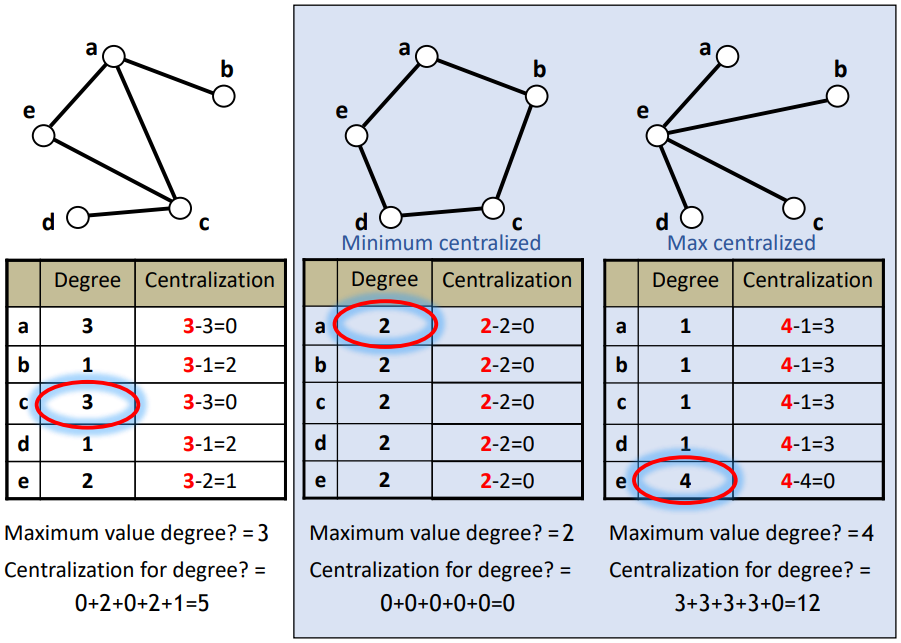

# Basic Measures

With respect to the considered level of analysis, there are some measures that can be computed for each of them. Focusing on centrality means focusing on a node's position in a network, at the individual level. It may be important for bridging other nodes or for the power derived by occupying that position.

## Degree centrality

### Directed Network

Consider a direct network, whose adjacency matrix is not symmetric. The In degree indicates the popularity of a node, while the out degree indicates its connection with other nodes.

```{=tex}
\begin{table}[h]
\centering
\begin{tabular}{@{}llllllll@{}}
\toprule
                   & \textit{Ross} & \textit{Phoebe} & \textit{Rachel} & \textit{Monica} & \textit{Chandler} & \textit{Joe} & \textbf{Out Degree} \\ \midrule
\textit{Ross}      & 0             & 0               & 1               & 0               & 0                 & 0            & 1                   \\
\textit{Phoebe}    & 0             & 0               & 0               & 0               & 0                 & 0            & 0                   \\
\textit{Rachel}    & 1             & 1               & 0               & 1               & 1                 & 1            & 5                   \\
\textit{Monica}    & 0             & 1               & 0               & 0               & 0                 & 0            & 1                   \\
\textit{Chandler}  & 0             & 0               & 1               & 1               & 0                 & 1            & 3                   \\
\textit{Joe}       & 0             & 0               & 0               & 0               & 1                 & 0            & 1                   \\
\textbf{In Degree} & 1             & 2               & 2               & 2               & 2                 & 2            &                     \\ \bottomrule
\end{tabular}
\caption{Nominations in Friends (directed relationship), showing for each person its out and in degree}
\label{tab:dir_degree}
\end{table}
```
This degree centrality can be normalized to get the proportion of outcoming/incoming connections for each node, by dividing the in/out-degree by the total number of people remaining ($n-1$, or the maximum possible connections that a node could have):

```{=tex}
\begin{table}[h]
\centering
\begin{tabular}{@{}llllllll@{}}
\toprule
                   & \textit{Ross} & \textit{Phoebe} & \textit{Rachel} & \textit{Monica} & \textit{Chandler} & \textit{Joe} & \textbf{Out Degree} \\ \midrule
\textit{Ross}      & 0             & 0               & 1               & 0               & 0                 & 0            & 1/5 = 0.2           \\
\textit{Phoebe}    & 0             & 0               & 0               & 0               & 0                 & 0            & 0                   \\
\textit{Rachel}    & 1             & 1               & 0               & 1               & 1                 & 1            & 5/5 = 1             \\
\textit{Monica}    & 0             & 1               & 0               & 0               & 0                 & 0            & 1/5 = 0.2           \\
\textit{Chandler}  & 0             & 0               & 1               & 1               & 0                 & 1            & 3/5 = 0.6           \\
\textit{Joe}       & 0             & 0               & 0               & 0               & 1                 & 0            & 1/5 = 0.2           \\
\textbf{In Degree} & 1/5 = 0.2     & 2/5 = 0.4       & 2/5 = 0.4       & 2/5 = 0.4       & 2/5 = 0.4         & 2/5 = 0.4    &                     \\ \bottomrule
\end{tabular}
\caption{Nominations in Friends (directed relationship), showing for each person its out and in degree}
\label{tab:norm_dir_degree}
\end{table}
```
### Undirected Network

In this case, the in-degree and the out-degree are the same, since we do not distinguish the type of connections. It can be considered as a double arrow pointing to both sides:

$$
d_i = \sum_j x_{ij}
$$

High degree centrality can be seen as higher risk of receiving whatever flows through the network, since these nodes are more visible and tend to be seen as important.

```{=tex}
\begin{table}[h]
\centering
\begin{tabular}{@{}llllllllllll@{}}
\toprule
\textbf{}       & \textbf{Ned} & \textbf{Marge} & \textbf{Homer} & \textbf{Abe} & \textbf{Maggie} & \textbf{Bart} & \textbf{Lisa} & \textbf{Krusty} & \textbf{Bob} & \textbf{Cecil} & \textbf{Degree} \\ \midrule
\textbf{Ned}    & 0            & 1              & 1              & 1            & 0               & 1             & 0             & 0               & 0            & 0              & 4               \\
\textbf{Marge}  & 1            & 0              & 1              & 0            & 1               & 0             & 1             & 0               & 0            & 0              & 4               \\
\textbf{Homer}  & 1            & 1              & 0              & 1            & 1               & 1             & 1             & 0               & 0            & 0              & 6               \\
\textbf{Abe}    & 1            & 0              & 1              & 0            & 0               & 1             & 0             & 0               & 0            & 0              & 3               \\
\textbf{Maggie} & 0            & 1              & 1              & 0            & 0               & 0             & 1             & 0               & 0            & 0              & 3               \\
\textbf{Bart}   & 1            & 0              & 1              & 1            & 0               & 0             & 1             & 1               & 0            & 0              & 5               \\
\textbf{Lisa}   & 0            & 1              & 1              & 0            & 1               & 1             & 0             & 1               & 0            & 0              & 5               \\
\textbf{Krusty} & 0            & 0              & 0              & 0            & 0               & 1             & 1             & 0               & 1            & 0              & 3               \\
\textbf{Bob}    & 0            & 0              & 0              & 0            & 0               & 0             & 0             & 1               & 0            & 1              & 2               \\
\textbf{Cecil}  & 0            & 0              & 0              & 0            & 0               & 0             & 0             & 0               & 1            & 0              & 1               \\ \bottomrule
\end{tabular}
\caption{Adjacency matrix of the undirected network of The Simpsons.}
\label{tab:undirected_network}
\end{table}
```
## Density and average degree

The simplest measure of cohesion is density, which is the number of ties in the network, expressed as a proportion of the number possible.

### Directed Network

$$
Density = \frac{\text{Number of ties}}{\text{Number of possible ties}} =\frac{\text{Number of ties}}{n(n-1)} 
$$

The number of possible ties, without considering self-loops, equals $n(n-1)$. The number of ties equals the sum of the adjacency matrix.

<aside>

💡 *For instance, by considering the Friends network, we can say that there are 11 ties and 6 people, so the density equals* $D = 11/(6\cdot 5) = 11/30 = 0.367$.

</aside>

This number indicates the percentage of direct connections between nodes inside the network.

### Undirected Network

In this case, the number of ties can be obtained by doubling the sum of half-matrix, since it is symmetric. The number of possible ties in this case is divided by two, since it is symmetrical and $(a,b) = (b,a)$:

$$
Density = \frac{\text{Number of ties}}{\text{Number of possible ties}} =\frac{\text{Number of ties}}{\frac{n(n-1)}{2}} 
$$

<aside>

💡 *In the Simpsons example, where there are 18 edges and 10 nodes, the density equals* $D = 18/(10\cdot 9/2) = 18/45 = 0.4$.

</aside>

### Average Degree

Since the density may assume a different meaning if we compare small and big size networks, the average degree is usually used in substitution to the density. It represents the average number of ties each node has.

Related to directed network, the average in-degree equals the sum of the in-degree or out-degree over the total number of nodes inside the network:

<aside>

💡 *In the Friends example, the average in-degree is* $11/6 = 1.833$, while the out-degree is $11/6 = 1.833$.

</aside>

The normalized degree of each node is computed by dividing the in and out-degree by $n-1$.

The normalized in degree and the out degree will give in the end the same sum. In particular, their mean equals the density of the entire network: in the density computation, total edges are divided by $n(n-1)$, while in the normalized degree, everything is normalized by $n-1$ and then the average requires another division over $n$,

### Importance of density

The **density** is useful whenever we need to compare networks, whether same or different sizes. In particular, the bigger, the more important density becomes to evaluate its cohesiveness.

Notice that a bigger network makes it harder to have a bigger density than a smaller one. Comparing the density of networks of different sizes can be challenging. It would be better to compare average degrees but notice that **by increasing the network size and the average degree, the density reduces.**

## Degree-centralization

**Centralization** is a question about how central some nodes are compared to other nodes and therefore can be considered as a characteristic of the network itself. It is related to the distribution of the centrality inside the network, so to the extend a network is dominated by a single node; while centrality is more related to the individual sphere of the nodes.

<aside>

💡 *The least centralized network is a ring structure, where everyone is connected to the previous and following node (in this case the centralization is 0). The most centralized network is an ego one, where one node is connected to everyone and no one else is connected to nodes different from the ego (in this case the centralization measure is far from 0).*

</aside>

Centralization may indicate the status of some nodes inside a network.

### Undirected Network

By taking the maximum degree inside the network, for each node, we subtract its degree to this maximum, in order to get its centralization. The centralization for the degree is then obtained by summing all these centralizations.

<aside>

💡 *Note that the maximum number of connections we could build in a centralized network is* $n-1$. In a decentralized network, if everybody has the same number of connections, the centralization will always be 0, since the maximum will be the same for every node.

</aside>

```{r, echo=FALSE, fig.align='center', fig.pos='h!', out.width='50%', fig.cap=""}

```

By considering the range between the least and the most centralized (i.e. $[0,12]$), the centralization can be finally computed by dividing the centralization for the degree by the maximum centralization value possible.

<aside>

💡 *In the example above, it would be* $5/12$.

</aside>

The general formula for the centralization is the following:

$$
Centralization = \frac{\sum (\max-degree_i)}{(n-1)(n-2)}
$$

### Directed Network

In the case of a directed network, we detain both in and out-degree centralization.

$$
In-Centralization = \frac{\sum (\max_{in}-\text{in-degree}_i)}{(n-1)^2}
$$

$$
Out-Centralization = \frac{\sum (\max_{out}-\text{out-degree}_i)}{(n-1)^2}
$$

<aside>

💡 *Still, if we consider Friends' network, we notice that related to the out-degree centralization, the network is kind of centralized on Rachel, which is talkative with everybody:*

</aside>

$$
Out-C = \frac{(5-1)+(5-0)+(5-1)+(5-5)+(5-3)+(5-1)}{5^2} = \frac{19}{25} = 0.76
$$

<aside>

💡 Related to the in-degree instead, the network is decentralized. By thinking about how is more popular than other characters, nobody is the true main star of the show, despite Ross is quite less cited by other people. This means that everybody is as popular as everybody else. It is not perfect yet actually, because of Ross.

</aside>

$$
In-C = \frac{(2-1)+5*(2-2)}{5^2} = \frac{1}{25} = 0.04
$$

### Experiment of Bavelas and Leavitt

*💡 How fast a group could make decisions together?*

Bavelas and Leavitt conducted a series of experiments at the MIT. They aim to study the best communication structure for group problem-solving. Each subject was given a card, with 5 symbols from a set of 6. Each symbol appeared on 4 of the 5 cards, except for one. The group was asked to find the common symbol in the shortest time possible.

The subjects communicated by writing messages that could be passed through slots in the walls of the cubicles. Four structures were proposed:

-   **ring structure:** no consistent pattern of organisations, since subjects sent messages only when receiving or work out the answer themselves;
-   **straight line:** most of the time the answer was sent out by the individual in the most central position;
-   **cross figure:** the peripheral sent information to the center, where answered arrived and were sent out.
-   **t-figure:** the most central figure got all the information and sent the answer. Slower than the cross, but still working.

The most efficient structure is the T-figure. During the experiment, the person in the middle in the cross figure didn't understand the experiment at all, therefore the information was useless. It's the classical structure with the team leader that commands the actions to take. It actually depends on the leadership ability of the central node, otherwise there is no learning.

The efficiency is given by the velocity and availability to communicate. Simple things benefit from the decentralized problems, whereas complex problems benefit from the centralized option, since the divide et impera organisation makes everything more efficient.

Evaluation:

-   satisfaction: ring structure;
-   less errors: T-figure;
-   like: ring-structure;
-   at least one error: cross and T-figure

**Aim: find a balance between efficiency and satisfaction.**
