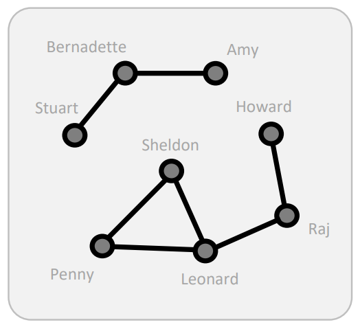
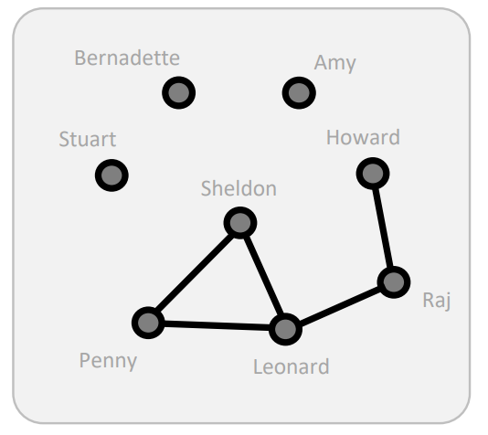

# Cohesion measures

*How can we compute whether a network is cohesive or not?*

When we talk about cohesion, we're focusing on the **group level of analysis**. 

## Direct connections

### Density

*What proportion of ties is present? What proportion of pairs of nodes is directly connected?*

It's the simplest measure of cohesion, the number of ties in the network, expressed as a proportion of the number possible. 

Given an undirected network, its number of possible ties is $n(n-1)/2$:

$$
Density = \frac{\text{Number of ties}}{\text{Number of possible ties}}
$$

<aside>
⚛️ *For instance, in this TBBT network, the density is 1/4 (7 actual ties, with 8 nodes, so 8*7/2 = 28 possible ties).*

</aside>

```{r echo=FALSE, message=FALSE, warning=FALSE}
library(sna)
tbbt = as.network(as.matrix(read.csv("datasets/the_big_bang_theory.csv", row.names = 1, stringsAsFactors = FALSE)), directed=F)
par(mar = c(0,0,0,0))
plot(tbbt, 
     vertex.cex = 3,
     displaylabels=T)
```

### Average Degree

*What is the average number of connections for nodes?*

<aside>
⚛️ *The average degree of connections for nodes is:* $(1+2+1+1+2+2+2+2)/8 = 1.625$.

</aside>


Remember that density does not tell us how these ties are distributed among the nodes.

## Components

*How many different groups of nodes exist that cannot reach each other (directly or indirectly)?*

A component is a maximum set where everyone is connected with each other.

<aside>
⚛️ *In the Big Bang Theory network, the components are two, as shown in the image*.

</aside>

Imagine that everyone has a piece of information that needs to be propagated. The more components, the less information everyone is reaching and the worse it is. The number of components of a network goes from 1 to the total number of nodes $n$. We should think of components as a way to spread creativity inside the network. All groups hold unique ideas and being one component allows for exposure to more ideas. 

### Component ratio

The component ratio is given by the number of components minus 1, over the maximum number of components minus 1:

$$
CR = \frac{c-1}{n-1}
$$

<aside>
⚛️ *In TBBT example, the component ratio would be $(2-1)/(8-1) = 1/7$.*

</aside>

1 means that all nodes are isolated, while 0 means there's one single component. 

Notice that the component ratio does not tell us anything about the distribution of these components. The size of the largest component is a function of the network size, but it doesn't tell us anything about the smaller components.

### Connectedness and fragmentation

<aside>
⚛️ The two networks below are similar to the largest components, but not the same.

</aside>

```{r, echo=FALSE, fig.align='center', fig.pos='h!', out.width='50%', fig.cap=""}

```

```{r, echo=FALSE, fig.align='center', fig.pos='h!', out.width='50%', fig.cap=""}

```

*What proportion of pairs of nodes can reach each other directly or indirectly?*

<aside>
⚛️ *In the first example, Amy, Bernadette and Stuart reach each other $(3\cdot2)$, whereas the others $5$ are connected among them $(5\cdot4)$ , so $(3\cdot2+5\cdot4)/(8\cdot7) = 0.464$.
In the second example, since the first three nodes do not reach each other, we have $(0+0+0+5*4)/(8*7) = 0.357$.*

</aside>

This proportion is called **connectedness**, while its complement is called **fragmentation ($fragmentation = 1-connectedness$)**. Notice that these measures do not inform about how long it takes to reach other nodes inside the same component:

$$
Connectedness = \frac{\sum_{i = \text{number of nodes in ith component}} i(i-1)}{n(n-1)}
$$

## Geodesic

### Compactness and breadth

We can study the average distance between two nodes, based on cohesion measures. Remember that longer distances reduce information sharing since it is quite expensive to reach them. The lower the average distance, the easier it is to reach other nodes and therefore the more the network is cohesive and preferrable.  

<aside>
⚛️ *For instance, the distance from Howard to Leonard is 2. If we want to compute the average distance between any couple of nodes inside the TBBT network, we need to consider disconnected nodes with inf distance, as shown in the geodesic distance matrix, which shows the minimum number of links to pass in order to reach a specific node.*

</aside>

```{r}
geodist(tbbt)$gdist
```

By convention, Inf is expressed as 0 if we consider $1/\text{geodesic distance}$, also called **reciprocal distance**:

```{r}
1/(geodist(tbbt)$gdist)
```

Excluding the diagonal, the **compactness** is expressed as the average of the reciprocal distance. **Breadth** is the complement of compactness (1-compactness). 

### K-step approach

The k-step approach tries to find *what proportion of pairs of nodes can reach each other in k steps.* It is a distance-based measure of cohesion.

<aside>
💡 *For instance, given the geodesic distance, what is the proportion of nodes that can reach each other in less than 3 steps?*

</aside>

```{r}
# Adjacency matrix of how many steps are necessary to reach other nodes
steps_3 = geodist(tbbt*tbbt*tbbt)$gdist

# Counting the undirected edges that reach other nodes in less than 3 steps
less_then_3_steps = sum(steps_3 < 3 & steps_3 > 0)/2
n = 8
# Proportion of nodes that reach each other in less than 3 steps
less_then_3_steps/(n*(n-1)/2)
```

## Exercises

### Comment on the results obtained

- Density
    
    Density assumes the same value for all the networks. 
    
- Connectedness
    
    In networks composed of one single component, obviously, everyone is connected with everyone else, promoting easy information sharing. 
    
    Within some components, for instance in network $6$ there's a completely connected component between Stuart, Sheldon, Penny and Leonard, which reduces the cost of information sharing. 
    
- Compactness
    
    The difference between the two networks with one component, we notice that in terms of compactness the fourth takes fewer steps to reach every other node in the network. If we consider the $2$ steps reach in fact, we notice that it is higher in network $4$ than in $3$. 
    

*Considering the money to spend on the process of information sharing. Which network would be more helpful?*

In this case, components play a key role in terms of reachability. So networks as $4$ and $3$ are preferable. 

*In terms of information sharing and studying for an exam to gain a certain competence?*

Direct connections are more helpful than greater components. It's hard to transfer knowledge from multiple people to one. 

*When thinking to find a resource online?*

It's probably better to request it from multiple people that suggest more courses as possible.