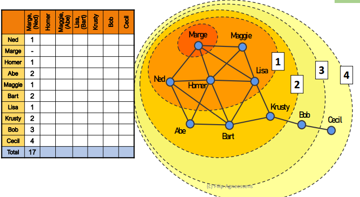
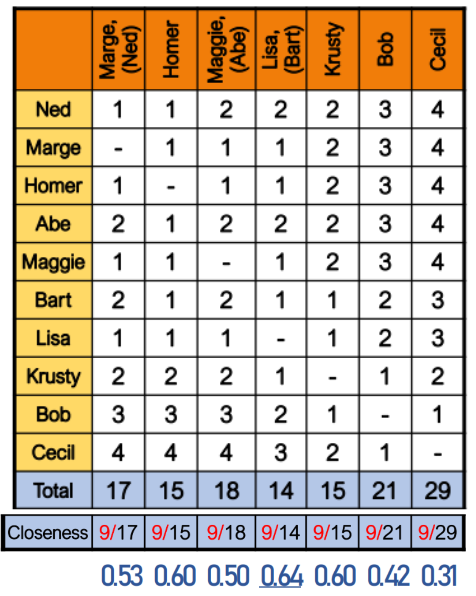
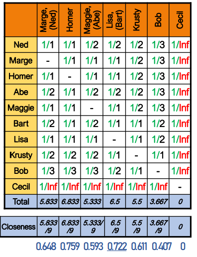
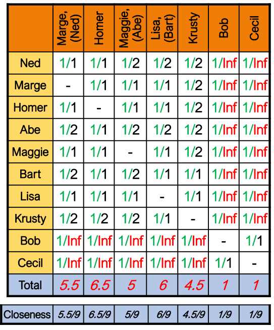
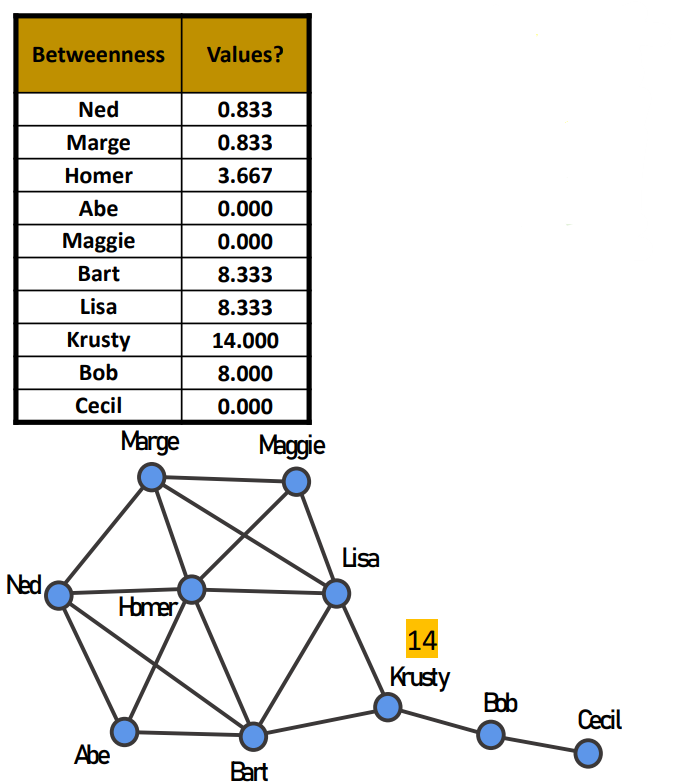
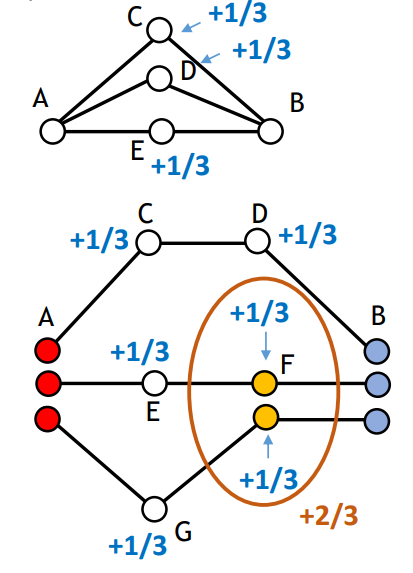

# Centrality

```{r message=FALSE, warning=FALSE, include=FALSE}
library(kableExtra)
```

## Degree Centrality

The aim of degree centrality is to find the node that reaches as many people as possible in one single step. 

## Closeness Centrality

*How to discover who's the most central node in the network? If you have information that you want everyone in the group to have, and you can only give it to one person in the group, who would you give it to?*

Every extra step needed to reach someone decreases accuracy and increases costs. A **geodesic** is the shortest path between two actors. Geodesics are not necessarily unique, there could be multiple paths of equally short length. A long geodesic distance implies that, even under the very best conditions, it would be a long time before something gets from one node to the other. 

In the following subsections, two versions of the closeness centrality will be presented: Freeman’s approach, which is about reaching everyone in the minimum number of steps; the reciprocal approach, which is about reaching the highest number possible in a few steps.


### Freeman's closeness centrality

Freeman defines closeness centrality as the sum of geodesic distances from a node to all others. Large numbers indicate that a node is highly peripheral, while small numbers indicate that a node is more central. We start with a person that has the information and in one step we count how many of them have been reached starting from him/her. 

<aside>
 *Consider the following example where we start from Marge and try to reach for every other node in the network.*

</aside>

Some nodes may be equivalent, especially when they're interchangeable. 

```{r, echo=FALSE, out.width = "80%", fig.cap="Example of Freeman Closeness centrality", fig.align='center'}

```
```{r, echo=FALSE, out.width = "40%", fig.cap="Example of Freeman Closeness centrality", fig.align='center'}

```

By considering the final table obtained by counting the necessary steps to reach any other node starting from a specific one, we obtain the table below. We can notice how Homer and Krusty are equivalent since they reach in the same number of steps all the nodes in the network, but Lisa and Bart minimize the cost with equivalent connections. On the other side, Cecil maximizes the path cost to reach all the other nodes. 

These values can be normalized by computing the reciprocal, multiply for the minimum value possible: $n-1$, which equals $9$ in the Simpsons' example. 

The lower the closeness, the less central a node is; the higher the closeness, the more central a node becomes. This can be computed through the following command on R:

```{r message=FALSE, warning=FALSE}
library(sna)
Simpsons_n = as.matrix(read.csv("datasets/simpsons.csv", 
                                row.names=1, 
                                stringsAsFactors = F))
closeness = sna::closeness(Simpsons_n, gmode="graph")
```

```{r echo=FALSE, message=FALSE, warning=FALSE}
kbl(data.frame(cbind(Name = rownames(Simpsons_n),
                     Closeness = round(closeness, 3))),booktabs=T)%>%
  kable_styling(position = "center")
```

*What happens if we add multiple components?*

The other nodes will never be reached, therefore it is counted as $Inf$ (i.e. undefined), but it shouldn't be summed up to other steps, or every node will be equivalently central. Considering the code, we would obtain:

```{r}
Simpsons_n2<-Simpsons_n
# Remove Cecil edges
Simpsons_n2[9,10]<-0
Simpsons_n2[10,9]<-0
sna::closeness(Simpsons_n2, gmode="graph")
```

Whoever we choose, will never reach everyone. But suppose we set a maximum cost for reaching a node, despite they're not connected and cannot reach each other. In this case, we can normalize as before and choose the highest value, remembering that still we cannot reach everyone. 

### Reciprocal closeness centrality

To overcome the limitation of the previous centrality measure whenever we have more components, we change the aim.

*If you have information that you want as many people as possible in the group to have, and you can only give it to one person in the group, who would you give it to?*

By using the reciprocal distances (1/geodesic distance), then unreachable nodes value $1/\infty$, therefore 0. 

```{r}
# Hand computing the reciprocal closeness
rec_geo = 1/geodist(Simpsons_n2)$gdist
rec_geo = replace(rec_geo,rec_geo == Inf,0)
n = nrow(rec_geo)-1
rec_clo = colSums(rec_geo)/n
```

```{r echo=FALSE}
kbl(data.frame(Name = rownames(Simpsons_n),
               Closeness = rec_clo), booktabs=T)%>%
  kable_styling(position = "center")
```

Considering this centrality measure, the most central node is Homer, since there is not a single component anymore, but two separated ones and Lisa/Bart took advantage of the fact that they could have reached both sides of the network, while now they can't. 

```{r, echo=FALSE, fig.align='center', fig.pos='h!', out.width='50%', fig.cap="Reciprocal Closeness in the Simpsons network where Cecil has no edges"}

```

```{r}
# Remove the link between Bob and the rest of the network
Simpsons_n2<-Simpsons_n
Simpsons_n2[8,9]<-0
Simpsons_n2[9,8]<-0

rec_geo = 1/geodist(Simpsons_n2)$gdist
rec_geo = replace(rec_geo,rec_geo == Inf,0)
n = nrow(rec_geo)-1
rec_clo = colSums(rec_geo)/n

```

```{r echo=FALSE}
kbl(data.frame(Name = rownames(Simpsons_n),
               Closeness = rec_clo), booktabs=T)%>%
  kable_styling(position = "center")
```

```{r, echo=FALSE, fig.align='center', fig.pos='h!', out.width='50%', fig.cap="Reciprocal closeness with Bob and Cecil as separated component"}

```

By changing the network structure, separating both Bob and Cecil, we get different interpretations of this centrality measure: Bob reduces its closeness, while Cecil augments it for being connected to someone. Other nodes increase their closeness since they're more connected to the people inside their component. 

```{r}
Simpsons_n3<-Simpsons_n
Simpsons_n3[8,9]<-0
#Simpsons_n3[9,8]<-0

df = data.frame(
    "Name" = rownames(Simpsons_n),
    `Reciprocal Closeness Centrality` = sna::closeness(Simpsons_n3, 
                                                       gmode="graph",
                                                       cmode="suminvundir"))
```

```{r echo=FALSE}
kbl(df, col.names = gsub("[.]"," ", names(df)), booktabs=T)%>%
  kable_styling(position = "center")
```

## Betweenness Centrality

*Who is important as an “in-between” person to transfer information?*

This centrality is about the gatekeepers between two nodes that gain power from this situation, in terms of potential for controlling flows through the network. The more nodes in between, the more extra points are earned to connect other nodes. Betweenness centrality is a measure of how often a node falls along the shortest path between two other nodes:

$$
b_j = \frac{\sum_{i<k}g_{ijk}}{g_{ik}}
$$

with $g_{ijk}$ being the number of geodesic paths connecting $i$ and $k$ through $j$ and $g_{ik}$ the total number of geodesic paths connecting $i$ and $k$. Whenever a node is an isolate or whenever every alter it has is connected to every other alter, the betweenness falls to $0$. 

<aside>
 *Consider Lisa as the in-between person we're interested in. She's important whenever she connects all nodes except for Abe to the line composed of Krusty, Bob and Cecil.*

</aside>

When there are alternative paths to get from A to B, then the importance of every node in-between diminishes, because it is split among all in-between nodes (alternatives). For non-unique shortest paths, each actor gets $1/\text{number of shortest paths}$.

<aside>
 *Related to the Simpsons' example, we can compute the betweenness centrality for each character and then find out that Krusty has the highest betweenness centrality since without him there are no alternative paths for reaching Bob and Cecil and vice-versa.*

</aside>

```{r, echo=FALSE, fig.align='center', fig.pos='h!', out.width='50%', fig.cap=""}

```
<aside>
💡 *In the first example, there are these three nodes that can be used as alternatives. In the second example, there are three paths from A to B, which comprehend in between nodes C, D, E, F and G.*

</aside>

```{r, echo=FALSE, fig.align='center', fig.pos='h!', out.width='30%', fig.cap=""}

```

```{r echo=FALSE}
kbl(cbind(Name = rownames(Simpsons_n),
          Betweenness = round(sna::betweenness(Simpsons_n, gmode="graph"), 3),
          "Normalized Betweenness" = round(sna::betweenness(Simpsons_n, gmode="graph")/(n*(n-1)/2), 3)),
    booktabs=T,
    caption = "Betweenness for Simpson's network")%>%
  kable_styling(position = "center")
```

The minimum value we can get is $0$, while the maximum is the number of possible links we could have in a network ($n(n-1)/2$), which equals $(9\cdot 8)/2 = 36$ in the Simpsons' case. Normally, betweenness centrality is normalized according to the maximum value possible. 

<aside>
 *In the case of Krusty, its betweenness centrality is $14/36 = 0.389$ which means that he's between two nodes shortest path nearly $39\%$ of the time.*

</aside>

## Resource Dependence Theory

According to Emerson's power from a dependency framework work, A has power over B to the extent that B is dependent on A:

1. B needs specific resources from A, therefore can exert power over it until B needs the resources;
2. There are no alternatives for B to A: the power disappears by increasing the number of alternatives.


According to Daniel Brass's work about being in the right place, the dependent variable is influence. He looked at closeness and betweenness centrality when focusing on newspaper publishing company employees. In particular:

- closeness centrality is expressed as **access** or minimal distance between a focal actor and all other persons;

- betweenness centrality is expressed as **control** or the relative extent to which a focal actor falls on the shortest path between any two other persons.

Also, there were three levels of analysis: workgroup, department and organization. According to the result:

- when it comes to a workgroup, access to the whole resources is important. When it came to controlling, it is not important;

- control instead is more pivotal at the organizational level, whereas access to resources has no importance since it is strict.

## Bonacich Beta Centrality

It is similar to closeness centrality because we worry about near connections with people that have a lot of connections. 

Beta centrality not only refers to geodesic, as closeness does, but also to all possible walks. Flowing of information can be repeated and changed, such as attitude and beliefs. Whenever we reinforce the same links over and over again, we may risk entering inside an echo chamber, so the repetition of connections (back and forward) may affect the centrality of a node. 

Closeness is a binary situation of connection, while Bonacich Beta Centrality is more on continuity and consistent connection between nodes. Bonacich based his idea on the fact that actors who have more connections are more likely to be powerful because they c1an directly affect more other actors.