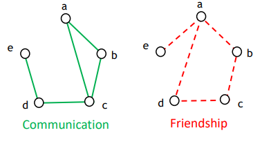
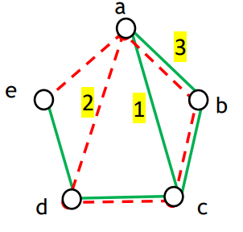
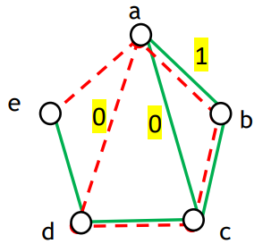
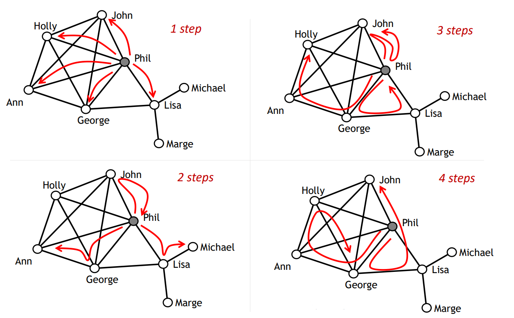
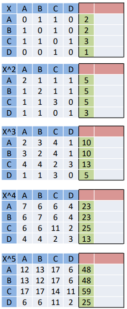
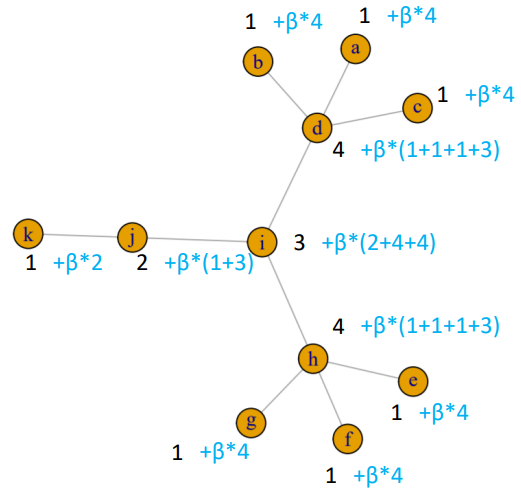

# Matrices and Beta centrality

## Matrix Algebra

### Adding two matrices

The matrices X and Y indicate the ties for 2 different network relations (e.g. communication and friendship network) for the same set of 5 actors (a,b,c,d,e):

```{r, echo=FALSE, fig.align='center', fig.pos='h!', out.width='50%', fig.cap=""}

```

```{r, echo=FALSE, fig.align='center', fig.pos='h!', out.width='50%', fig.cap=""}

```

Suppose we want to sum $X+2Y$. Considering their adjacency matrix, we get:

$$
\left(  
\begin{array}{ccccc}
0 & 1 & 1 & 0 & 0\\
1 & 0 & 1 & 0 & 0 \\
1 & 1 & 0 & 1 & 0 \\
0 & 0 & 1 & 0 & 1 \\
0 & 0 & 0 & 1 & 0 \\
\end{array}
\right)+2
\left(  
\begin{array}{ccccc}
0 & 1 & 0 & 1 & 1\\
1 & 0 & 1 & 0 & 0 \\
0 & 1 & 0 & 1 & 0 \\
1 & 0 & 1 & 0 & 0 \\
1 & 0 & 0 & 0 & 0 \\
\end{array}
\right) = 
\left(  
\begin{array}{ccccc}
0 & 3 & 1 & 2 & 2\\
3 & 0 & 3 & 0 & 0 \\
1 & 3 & 0 & 3 & 0 \\
2 & 0 & 3 & 0 & 1 \\
2 & 0 & 0 & 1 & 0 \\
\end{array}
\right)
$$

### Cell Multiplication

Suppose we want to compute $XY$. Considering their adjacency matrix, we get: 

```{r, echo=FALSE, fig.align='center', fig.pos='h!', out.width='50%', fig.cap=""}

```

$$
\left(  
\begin{array}{ccccc}
0 & 1 & 1 & 0 & 0\\
1 & 0 & 1 & 0 & 0 \\
1 & 1 & 0 & 1 & 0 \\
0 & 0 & 1 & 0 & 1 \\
0 & 0 & 0 & 1 & 0 \\
\end{array}
\right)\times
\left(  
\begin{array}{ccccc}
0 & 1 & 0 & 1 & 1\\
1 & 0 & 1 & 0 & 0 \\
0 & 1 & 0 & 1 & 0 \\
1 & 0 & 1 & 0 & 0 \\
1 & 0 & 0 & 0 & 0 \\
\end{array}
\right) = 
\left(  
\begin{array}{ccccc}
0 & 1 & 0 & 0 & 0\\
1 & 0 & 1 & 0 & 0 \\
0 & 1 & 0 & 1 & 0 \\
0 & 0 & 1 & 0 & 0 \\
0 & 0 & 0 & 0 & 0 \\
\end{array}
\right)
$$

### Matrix Multiplication of different matrices

Suppose the two matrices represent the flights and trains from a place to another. Then we can imagine the next scenarios:

- From point A to point A
- From point A to point B
- From point B to point B

## Bonacich Beta Centrality

Imagine there can be a repeated influence, such that it spreads on two or more steps. The image below represents some of the one, two, three and four steps paths inside the network:

```{r, echo=FALSE, fig.align='center', fig.pos='h!', out.width='50%', fig.cap=""}

```

$$
R = \sum^\infty_{k=1}(\beta^{k-1}X^k) = X+\beta X^2+\beta^2 X^3+\dots
$$

Imagine there can be a repeated influence and we want to capture popularity (i.e. being connected to many popular people). By looking at one single step, we get that node $d$ has beta centrality $\beta*(1+1+1+3)$, which represent the number of nodes that neighbours can reach. We then add an additional term $\beta^2$, multiplied for the number of nodes each neighbour can reach in two steps. 

```{r, echo=FALSE, fig.align='center', fig.pos='h!', out.width='50%', fig.cap=""}

```

```{r, echo=FALSE, fig.align='center', fig.pos='h!', out.width='50%', fig.cap=""}

```

Given the matrix $X$, we have the adjacency matrix of nodes A, B, C and D. We can compute all the two-steps adjacency paths and so on (i.e. $X^2, X^3, X^4,\dots$). We could compute the centrality by summing them up:

$$
c_B(A) = 2+5+10+23+48+\dots
$$

Instead of just summing them, we could insert the beta $\beta$ term which reduces the importance of the paths that necessitate of multiple steps:

$$
c_B(i) = XI+\beta X^2I+\beta^2X^3I+\dots
$$

By choosing, for example, $\beta = 0.1$, the beta centrality of $A$ becomes:

$$
c_B(A) = 1*2+0.1*5+0.01*10+0.001*23+0.0001*48+\dots
$$

In the end, we get for each node:

\begin{table}[h]
\centering
\begin{tabular}{@{}lll@{}}
\toprule
\textbf{Node} & \textbf{Beta Centrality} & \textbf{Norm} \\ \midrule
A             & 3.7096                   & 0.26          \\
B             & 3.7096                   & 0.26          \\
C             & 4.8706                   & 0.342         \\
D             & 1.9706                   & 0.138         \\ \bottomrule
\end{tabular}
\caption{}
\label{tab:my-table}
\end{table}


```{r message=FALSE, warning=FALSE}
library(igraph)
MAT4<-matrix(c(0, 1, 1, 0,
               1, 0, 1, 0,
               1, 1, 0, 1,
               0, 0, 1, 0),4,4)
MAT4i<-graph_from_adjacency_matrix(MAT4,
                                   mode=c("undirected"),
                                   diag=F)
# Beta value = 0.1
bonpow(MAT4i, exponent=0.1)

# Beta value = 0.1, with normalized values
bonpow(MAT4i, exponent=0.1)/sum(bonpow(MAT4i, exponent=0.1))

# Beta value = 0.2
bonpow(MAT4i, exponent=0.2)/sum(bonpow(MAT4i, exponent=0.2))
```

We could change the beta value to 0.2 and obtain:


\begin{table}[h]
\centering
\begin{tabular}{@{}lll@{}}
\toprule
\textbf{Node} & \textbf{Beta Centrality} & \textbf{Norm} \\ \midrule
A             & 2.6291                   & 0.256         \\
B             & 2.6291                   & 0.256         \\
C             & 3.6624                   & 0.356         \\
D             & 1.3662                   & 0.132         \\ \bottomrule
\end{tabular}
\caption{}
\label{tab:my-table}
\end{table}

## Graph exercise

```{r}
MAT11<-matrix(c(
0, 0, 0, 1, 0, 0, 0, 0, 0, 0, 0,
0, 0, 0, 1, 0, 0, 0, 0, 0, 0, 0,
0, 0, 0, 1, 0, 0, 0, 0, 0, 0, 0,
1, 1, 1, 0, 0, 0, 0, 0, 1, 0, 0,
0, 0, 0, 0, 0, 0, 0, 1, 0, 0, 0,
0, 0, 0, 0, 0, 0, 0, 1, 0, 0, 0,
0, 0, 0, 0, 0, 0, 0, 1, 0, 0, 0,
0, 0, 0, 0, 1, 1, 1, 0, 1, 0, 0,
0, 0, 0, 1, 0, 0, 0, 1, 0, 1, 0,
0, 0, 0, 0, 0, 0, 0, 0, 1, 0, 1,
0, 0, 0, 0, 0, 0, 0, 0, 0, 1, 0),11,11)

# Creation of the graph
GRAPH11<-graph_from_adjacency_matrix(MAT11,mode=c("undirected"),diag= FALSE)

bonpow(GRAPH11, exponent=.1)/sum(bonpow(GRAPH11, exponent=.1)) # Beta value = 0.1

bonpow(GRAPH11, exponent=.2)/sum(bonpow(GRAPH11, exponent=.2)) # Beta value = 0.2

bonpow(GRAPH11, exponent=.3)/sum(bonpow(GRAPH11, exponent=.3)) # Beta value = 0.3

bonpow(GRAPH11, exponent=.4)/sum(bonpow(GRAPH11, exponent=.4)) # Beta value = 0.4

bonpow(GRAPH11, exponent=.5)/sum(bonpow(GRAPH11, exponent=.5)) # Beta value = 0.5

bonpow(GRAPH11, exponent=0)/sum(bonpow(GRAPH11, exponent=0)) # Beta value = 0

bonpow(GRAPH11, exponent=-.1)/sum(bonpow(GRAPH11, exponent=-.1)) # Beta value = -0.1
```