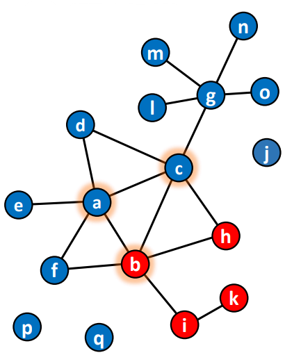

---
output:
  pdf_document: default
  html_document: default
---
# Attributes based measures

## Resourcefulness

Resource generator relates to people with more resources. Resourcefulness usually establishes the measures of zero (nothing) and total (everything). 

<aside>
💡 *It is not only related to money but for instance to happiness: the more happy people we're related with, the more good vibes we will gather.*

</aside>

```{r, echo=FALSE, fig.align='center', fig.pos='h!', out.width='50%', fig.cap=""}

```

The resourceful alter can be computed through the total or the average:

- total:
    
    $$
    sum \ R_i = \sum_j x_{ij}r_j
    $$
    
- average
    
    $$
    avg \ R_i = \frac{ \sum_j x_{ij}r_j}{\sum_j x_{ij}}
    $$
    
```{r, echo=FALSE, fig.align='center', fig.pos='h!', out.width='50%', fig.cap="", fig.show="hold"}
knitr::include_graphics(c("images/06-Attributes based measures/Untitled 1.png",
                          "images/06-Attributes based measures/08-graph.png"))
```

\begin{table}[]
\centering
\begin{tabular}{@{}llll@{}}
\toprule
\textbf{Node} & \textbf{Neighbours} & \textbf{Total R} & \textbf{Average R} \\ \midrule
a             & b, d, e             & 45+25+21 = 91    & 91/3 = 30.3333     \\
b             & c                   & 32               & 32                 \\
c             & a, b                & 19+45 = 64       & 64/2 = 32          \\
d             & a, c                & 19+32 = 51       & 51/2 = 25.5        \\
e             & a, c, d             & 19+32+25 = 76    & 76/3 = 25.333      \\ \bottomrule
\end{tabular}
\caption{}
\label{tab:my-table}
\end{table}

Consider the adjacency matrix beside, where the green table indicates the number of resources held by nodes and the blue one is the adjacency matrix. We could then compute the resourcefulness of each node, both in terms of sum and average, as shown in the table. 


## Homophily

Which of the two networks is a good situation?

- it is good to be connected to similar people because they will get along, they understand each other, there is a common ground and they emphasize with each other;
- on the other side, to spread knowledge, to exit from our echo chamber is also important to face different realities.

We could simply compute **homophily** by computing the percentage of neighbours of the central node that belongs to the same category. 

<aside>
💡 *Suppose we talk about males and females ego networks. In the first example, there's 80% of homophily, followed by 40 and 60%.*

</aside>

```{r, echo=FALSE, fig.align='center', fig.pos='h!', out.width='70%', fig.cap=""}

```

To properly define homophily in ego networks, we recur to:

$$
EI_i = \frac{E_i-I_i}{E_i+I_i}
$$
where $E_i$ counts the number of different nodes from the ego and $I_i$ counts the number of similar nodes to the ego, whose sum $E_i+I_i$ must provide the total alters in the ego's network. 

```{r, echo=FALSE, fig.align='center', fig.pos='h!', out.width='30%', fig.cap="Example of a network, considering nodes a, b and d."}

```

Whenever we change our perspective considering a global network also our interpretation may change. For instance, by considering $a$, $b$ and $d$ in the image  as in the previous example, their connections change if we extend their ego networks. 

We could build a matrix by considering:

- nodes who are the same or different type as ego;
- whether these nodes are directly connected or not to an ego.

In complete networks as the one on the right, the homophily is computed as:

$$
Q_i = \frac{ad-bc}{ad+bc}
$$


```{r, echo=FALSE, out.width = "80%", fig.align='center', fig.pos='h!', fig.cap=""}

```

Whenever we have high $b$ and $c$, we have eterophily, tendency to choose different people from us; whenever $a$ and $d$ are high, homophily increases. 

<aside>
💡 *In the second network, b tends to prefer women to men, since she excludes most of the men from her connections. There's a high tendency to homophily. 
In the third network, says that he builds more connections with females than random chance. Also, he did not connect to a lot of males that were available.*

</aside>

The odds ratio divides $ad$ over $bc$. It causes problems whenever $bc$ is zero since it tends to infinity. 

$$
odds = \frac{ad}{bc}
$$

## Diversity

Differences in characteristics imply differences in resources, so when we connect with different people, we have access to different types of resources. The **index of quality variation** looks at one person and we care about other people categories (i.e. to what resources they can access):

- if all neighbours belong to the same category, the index values $0$;
- if we consider an ego network, in particular, the proportion of nodes per each category and sum their squared value, we get our value.
- if every alter belongs to a different category, the index equals $1$.

All values are normalized by the maximum value that the index can assume. 

```{r, echo=FALSE, fig.align='center', fig.pos='h!', out.width='30%', fig.cap="Example of a network with diversity"}

```

```{r, echo=FALSE, fig.align='center', fig.pos='h!', out.width='90%', fig.cap="Diversity computation"}

```

<aside>
💡 **Remember**: 
*heterophily among alters; 
homogeneity when all connections are the same category;
homophily among alters; 
heterophily within an ego network (people different from me that challenge me).*

</aside>