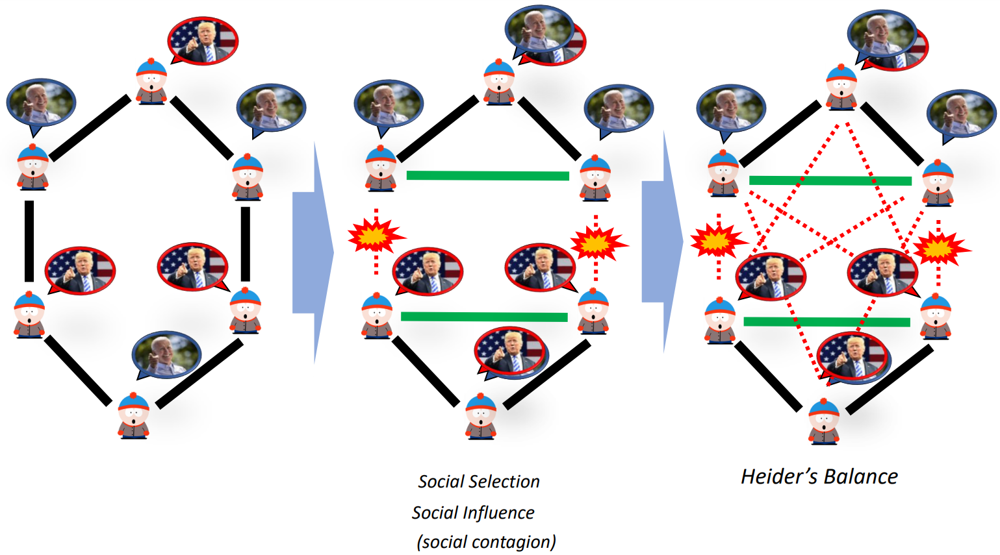
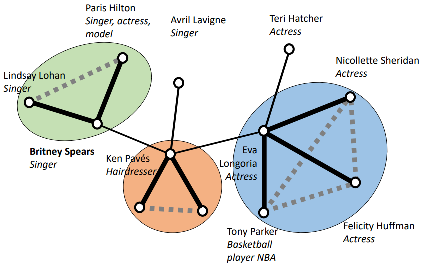
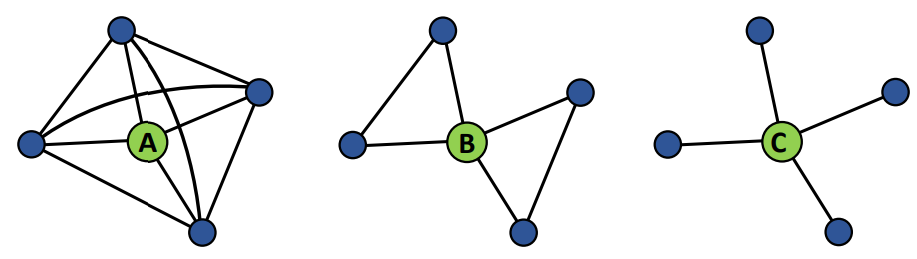
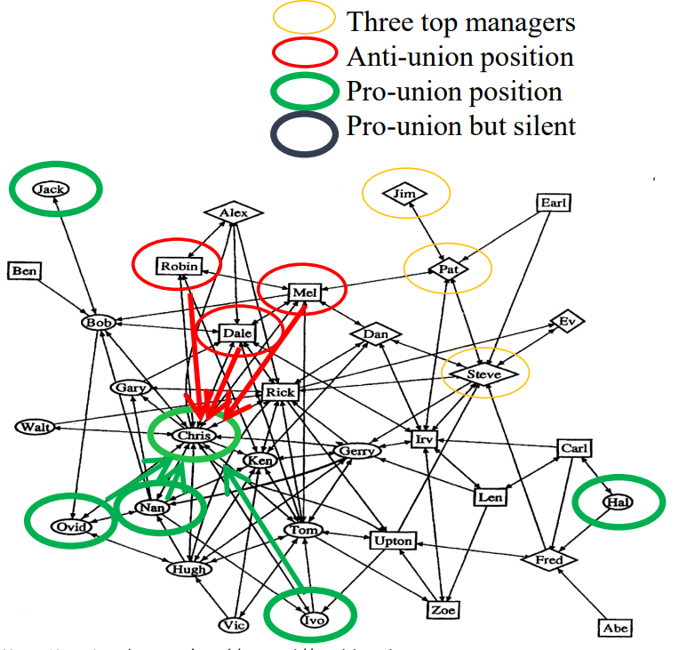
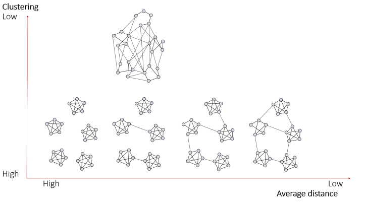

# Triads and structural holes

*Aim: Focus on the individual level, in particular on triads (groups of
three people).*

## Social Capital

According to Burt, \*Social structure is a kind of **capital** that can
create for certain individuals or groups a competitive advantage in
pursuing their ends. Better connected people enjoy higher returns. In
this definition, we can detect:

-   **Social capital:** seen as social relations and networks;
-   **Capital**: can be financial, human, cultural etc. We can define
    also who owns it;
-   **Competitive Advantage**: it means that who detains it has some
    benefits; whenever there are no more benefits related to a
    relationship, we talk about social liabilities. Benefits tend to
    have a positive effect on the entire network (i.e. tautology).

Individuals benefits from social capital: *"friends, colleagues, and
more general contacts through whom you receive opportunities to use your
financial capital and human capital"* (Burt, 1992).

Groups benefit from social capital, where shared goals include the
sharing of beliefs and norms: *"Social capital flows from the endowment
of mutually respecting and trusting relationships which enable a group
to pursue its shared goals more effectively than would otherwise be
possible"* (Szreter, 2000).

Remember that higher returns do not necessarily involve an active
investment. There could be some unintentional results: *"social capital
depends on being a byproduct of activities engaged in for other
purposes"* (Coleman, 1990). Also, Becker supposes that people choose
social networks in ways that will maximize their utility, since returns
may be actively created through social relations.

## General Balance Theory

<aside>


*Imagine two people, Stan and Kyle, supposing that the first is into
Trump and the second into Biden. Suppose they're friends but they have
opposite opinions about politics. What could happen next? Try to
convince each other and maintain the friendship or End the
relationship;*

</aside>

In case relationships are ended whenever we meet differences, we talk
about **social selection**. The issue here is that echo chambers may
rise, leading to groups of people that share the same knowledge over and
over again.

Instead, whenever we change our minds by interacting with others and
dialoguing pacifically, we talk about **social influence or contagion**.

## Heider's Balance Theory

It's about the attitude of people in groups of three. This theory
considers triads instead of dyads, as in the previous general theory.

<aside>

💡 *Suppose we're friends with someone that hates one of our friends. It
may happen in one of the following cases to bring everything into
balance:*

-   *End the relationship with one of the two;*
-   *Make them get along*.

</aside>

According to this theory is both possible social selection and social
influence, such that opposition groups are more strongly differentiated
from each other.

```{r, echo=FALSE, fig.align='center', fig.pos='h!', out.width='60%', fig.cap=""}

```

## Granovetter's Strength of Weak Ties

> *Weak ties provide people with access to information and resources
> beyond those available in their own social circle; but strong ties
> have greater motivation to be of assistance and are typically more
> easily available. ---- Granovetter, 1983*

In this theory, we do not focus on positive/negative ties, but on their
strength. Let's think about forbidden triads, defined as those triads
where there's a person that is strongly related to two people.

<aside>

💁️ Proposition: If there are 2 strong ties between 3 people, then there
will also be at least a weak tie between the others. Therefore, they
know each other, despite not being good friends. This theory is based on
a probabilistic assumption, therefore it may not happen all the time.

</aside>

A **forbidden triad** is defined as a combination of two strong ties and
a missing tie that links the missing two nodes.

Consider the following example, we can detect three communities, with no
structural bridge with strong ties. Weak ties are important because they
cross social circles to get unique information. This means that
information is spread between social circles via weak ties.

About the importance of acquaintances in social networks:

```{r, echo=FALSE, fig.align='center', fig.pos='h!', out.width='50%', fig.cap=""}

```

> *these clumps / [strong ties networks] could not, in fact, being
> connected to one another at all were it not for the existence of weak
> ties. ---- Granovetter, 1973*

## Simmel and triads

A relation between people in a dyad is of limited interest since it
refers to two people. The social dynamics becomes evident when referring
to three people: assuming equal individual power of (A, B and C), two
actors (A and C) can join forces against a third party (B) and therefore
build coalitions to force the third party (Simmel Theory).

## Coleman and closure

According to **Coleman's closure theory**, high density among people
creates group pressure. Closure ensures that group norms are reinforced
(joined control against freeriding, anti-social behaviour, etc.). This
enforces trust and reduces costs of monitoring and transaction costs
(tacit knowledge). In general, closure is a broader normative order
within which the individual can optimise performance.

## Burt's Structural Holes

Under a selfish and individualistic perspective, Burt's Structural Holes
theory is applied.

<aside>

💡 *By considering the three networks and nodes A, B and C, Coleman's
closure theory states that A is in a better position because of the
trust enabled by nodes in the network. Whereas Burt's theory prefers C
since we maximize the relationships and resources received by nodes that
must pass through C to communicate.*

</aside>

```{r, echo=FALSE, fig.align='center', fig.pos='h!', out.width='50%', fig.cap=""}

```

Betweenness centrality is relevant because it is about the flow of
resources between people we're connected to. In this case, $C$ has the
highest betweenness centrality, while A has the lowest. We can summarize
previous theories through $3$ main arguements that Burt has used:

1.  Simmel: No control over ego by others;
2.  Betweenness: power overflow of information and resources;
3.  Granovetter: access to unique information.

### Gould and Fernandez's Brokerage Positions

In this example, we look at gatekeepers, by focusing on different inputs
and outputs. According to Gould and Fernandez, there are different
brokerage positions:

-   coordinator: interaction between members of the same group;
-   gatekeeper: from an external group, it passes information to its
    group;
-   representative: diffuses knowledge from its group to another;
-   cosmopolitan: mediates as outsider members of the same group;
-   liaison: interaction between different groups.

## Krackhardt's Simmelian Ties

Krackhardt's disagrees with both Coleman and Burt's theories. According
to Krackhardt's, the node in the middle has to satisfy expectations of
both groups, which brings node B in the previous networks in a difficult
situation. This means that B is in the worst position possible because
of the social tension it may encapsulate.

<aside>

💡 *In his example of a Silicon Valley company, he created a friendship
network, establishing work position according to the color: manager,
pro-union, anti-union and silent positions. In the example, Chris is the
most central person and everybody will listen to him. Why? Because he
belongs to the pro-union position community, but all the anti-union
position workers are his friends. Instead of being at the centre of the
attention, Chris became silent because of the closeness to two different
groups.*

</aside>

```{r, echo=FALSE, fig.align='center', fig.pos='h!', out.width='50%', fig.cap=""}

```

## Small worlds and key players

### Six degrees of separation

Milgram's experiment in 1967 led us to the idea of six degrees of
separation, according to which between any two people there is a path of
length $6$ or less.

The value of $6$ was a result of an experiment by Stanley Milgram in
which he distributed letters randomly to people in two US cities and
asked them to pass them to a target, and, if they did not know the
target, to pass them to someone who might. He found the average number
of steps from originator to target was $6.4$. A second example was the
analysis of Microsoft Messenger in 2007 which at the time had $180$
million nodes and $1.3$ billion edges; it was calculated that the
average geodesic path length was $5.5$.

### Small World Effect

According to Watts and Strogatz, in society, there's a high level of
clustering, especially when the degrees of separation is that low.
Whenever we have a lower geodesic distance within the same cluster, with
few nodes, we may want to connect these small communities with some
ties: in this case, the average distance reduces.

A few changes in where we place ties makes some connected clusters into
a small world where anybody can reach anybody else in a few steps.

Human social systems are clumpy but also very compact, in the sense of
having surprisingly short paths linking everyone to everyone else. The
more transitivity there is in a network the longer path distances tend
to be. It only takes a few connections between clumps to shorten average
path length considerably, so the class of networks that are both clumpy
and have shorts paths is quite a bit bigger than initially thought.

By testing the clustering coefficient, we find out that it is large
relative to random graphs (in which the clustering coefficient will be
very close to graph density) and the average distance approaches the
average distance in random graphs (which is quite small).

By connecting the components with random bridges, by augmenting them, we
lower the average distance in the network, while if no components are
clearly detectable the clustering lowers.

```{r, echo=FALSE, fig.align='center', fig.pos='h!', out.width='80%', fig.cap=""}

```

### Keyplayers

Information only reaches the direct contacts of a person and our aim is to reach as many people as possible. Suppose we consider the following network: 

```{r echo=FALSE}
net_ex = matrix(c(0,0,0,0,0,0,0,0,0,0,0,1,1,0,0,0,0,0,0,
                  0,0,1,1,0,0,1,0,0,0,0,0,0,0,1,0,0,0,1,
                  0,1,0,1,0,0,0,0,0,0,0,0,0,0,0,0,0,0,0,
                  0,1,1,0,1,1,1,0,0,0,0,0,0,1,0,0,0,1,0,
                  0,0,0,1,0,0,0,0,0,0,0,0,0,0,0,1,0,0,0,
                  0,0,0,1,0,0,1,0,0,0,0,0,0,0,0,1,0,0,0,
                  0,0,0,1,0,1,0,1,1,0,0,0,0,0,0,1,0,1,0,
                  0,0,0,0,0,0,1,0,1,0,0,0,0,0,0,1,0,0,0,
                  0,0,0,0,0,0,1,1,0,1,1,1,0,0,0,0,1,1,0,
                  0,0,0,0,0,0,0,0,1,0,0,0,0,0,0,1,0,0,0,
                  0,0,0,0,0,0,0,0,1,0,0,1,0,0,0,0,0,0,0,
                  1,0,0,0,0,0,1,0,1,0,1,0,1,0,0,0,0,0,0,
                  0,0,0,0,0,0,0,0,0,0,0,1,0,0,0,0,0,0,0,
                  0,0,0,1,0,0,0,0,0,0,0,0,0,0,0,1,0,0,0,
                  0,1,0,0,0,0,0,0,0,0,0,0,0,0,0,0,0,0,0,
                  0,0,0,0,1,1,1,1,0,1,0,0,0,1,0,0,1,0,0,
                  0,0,0,0,0,0,0,0,1,0,0,0,0,0,0,1,0,0,0,
                  0,0,0,1,0,0,0,0,1,0,0,0,0,0,0,0,0,0,0,
                  0,1,0,0,0,0,0,0,0,0,0,0,0,0,0,0,0,0,0),19,19)

plot(as.network(net_ex, directed = F),
     vertex.cex = 1.5, 
     vertex.col = "cornflowerblue",
     displaylabels=T,
     label.cex = 0.7,
     edge.col = "grey60")
```


<aside>

💡 We want to reach as many people as possible and we can choose the
persons to which we can communicate the information. Who would we
choose?

-   $1$ person: $7$;
-   $2$ persons: $9, 4$;
-   $3$ persons: $12, 2, 16$, to reach everyone except for $18$;
-   $4$ persons: $12, 42 16, 18$.

We're trying to choose non redundant links to reach as many nodes as
possible. What if we remove these nodes? Will we still be able to reach
them all? Without $9$, $7$ and $4$, we will have three clusters, guided
by $12$, $2$ and $16$.

</aside>
