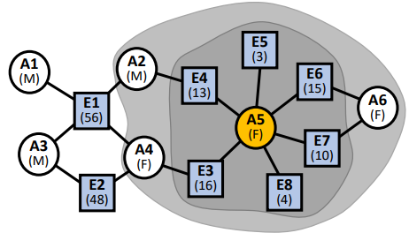

# Two mode networks


## Two-mode data

Whenever we focus on two-mode networks, we put effort on ties, not on actors, where there are two types of actors. As with 1-mode networks, we need to specify the boundary of the network:

- defined by events to which actors participate, missing other events to which those actors attended;
- by actors, to include some events, missing the other actors that attended those events.

```{r}
library(sna)
DSAm <- as.matrix(read.csv(
  "datasets/Davis_SouthernWomen_Attendance.csv",
  stringsAsFactors = FALSE, row.names=1))
DSAm

#if you want to limit the names to the first 
#two letters, us the following:
#Copy object
DSAmS<-DSAm
#Change names in new object
rownames(DSAmS)<-substring(rownames(DSAm),1,2)
DSAmS

#Now draw the network
gplot(DSAmS, displaylabels=TRUE, 
      usearrows=FALSE, gmode="twomode")
```

## One-mode projections

A one-mode projection is another way of representing two-mode projections by inserting links between nodes if they share a common link toward a node. In order to compute it:

1. Get the adjacency matrix;
2. Compute the transpose of this matrix;
3. Multiply the first matrix with the second one to compute two steps paths from a node to another.  

```{r}
# One-mode projection
DSAmS%*%t(DSAmS) # Matrix multiplication
t(DSAmS)%*%DSAmS # on the other verse

```

```{r, echo=FALSE, fig.align='center', fig.pos='h!', out.width='50%', fig.cap=""}

```

<aside>
💡 *What is the best approach to represent the level of overlapping?
- Sum of unique events shared by all actors over the total number of events;
- Unique events shared over the sum of degrees of all actors;
- Unique events shared over the minimum degree of all actors;
- Unique events shared over the maximum degree of all actors;*

</aside>

<aside>
💡 *With One-mode projections, we lose data. Check the example below.*

</aside>

```{r, echo=FALSE, fig.align='center', fig.pos='h!', out.width='50%', fig.cap=""}

```

## Bipartite

It is possible to compute a two-mode network centrality using bipartite one-mode: according to this modality, we put together actors and events. 

```{r, echo=FALSE, fig.align='center', fig.pos='h!', out.width='50%', fig.cap=""}

```

## Density

To compute the density of a two-mode network, compute the total number of edges and divide it for the maximum number of edges there could be. 

```{r}
# Getting the degree of a two-mode network
mean(DSAmS)
```

```{r, echo=FALSE, fig.align='center', fig.pos='h!', out.width='50%', fig.cap=""}

```

## Degree Centrality

```{r, echo=FALSE, fig.align='center', fig.pos='h!', out.width='50%', fig.cap=""}

```

Consider a network with scientists and papers, where $n_a$ defines the number of scientists and $n_e$ defines the number of papers. It is possible to compute:

- *How many publications ($E$) does each person ($A$) have?*
    
    $$
    \begin{aligned}
    A_1 = 1 \\
    A_2 = A_3 = A_6 = 2 \\
    A_4 = 3 \\
    A_5 = 6
    \end{aligned}
    $$
    
    ```{r}
    scientists_papers<-matrix(c(1,0,0,0,0,0,0,0,
    					        1,0,0,1,0,0,0,0,
    					        1,1,0,0,0,0,0,0,
    					        1,1,1,0,0,0,0,0,
    					        0,0,1,1,1,1,1,1,
    					        0,0,0,0,0,0,1,1),
    						    6,8,byrow=TRUE)
    rownames(scientists_papers)<-c("a1","a2","a3","a4","a5","a6")
    colnames(scientists_papers)<-c("e1","e2","e3","e4","e5","e6","e7","e8")
    gplot(scientists_papers, displaylabels=TRUE, usearrows=FALSE, gmode="twomode")
    rowSums(scientists_papers) # Scientists Degree
    colSums(scientists_papers) # Papers Degree
    ```
    
- *In what proportion of all publications ($E$) was a person ($A$) involved?*
    
    Divide the previous number for the total number of publications $n_e$ to obtain the proportion of collaboration in all papers. 
    
    ```{r}
    # Proportion of scientists participation in papers
    rowSums(scientists_papers)/NCOL(scientists_papers)
    
    # Proportion of papers collaboration in scientific community 
    colSums(scientists_papers)/NROW(scientists_papers)
    ```
    
- *What is $A$’s total contribution to all publications ($E$) taking into account the contribution of co-authors?*
    
    When computing the proportion, we consider the number of colleagues that collaborate on a specific paper. If a scientist works on more papers at a time (suppose $A_2)$, we just sum up that proportion. In a short way, compute the proportion of people that worked in a paper and then compute row sums of those proportions. 
    
    ```{r}
    # Get column sum = 1 and row sum equal 
    # the total contribution considering coauthors
    t(t(scientists_papers)/colSums(scientists_papers))
    
    # Total contribution to all papers by author
    rowSums(t(t(scientists_papers)/colSums(scientists_papers)))
    ```
    
- *What is $A$’s average contribution to all publications ($E$) taking into account the contribution of co-authors?*
    
    Take the previous value and divide it for the total number of papers in which he/she collaborated (which was the first column). 
    
    ```{r}
    (rowSums(t(t(scientists_papers)/
                 colSums(scientists_papers))))/
      rowSums(scientists_papers) # Scientists Degree
    ```
    

```{r, echo=FALSE, fig.align='center', fig.pos='h!', out.width='50%', fig.cap=""}

```
- *In total how many unique co-authors does $A$ have?*
    1. Number of co-authors
        
        Just count the neighbours of the authors, independently from the event $E$, so just consider the one-way projection of the network. We will get the numbers below, noticing that $A_2$ and $A_4$ are the most central nodes in the network. 
        
        <aside>
        $A_1 \quad 3\\
        A_2 \quad 4\\
        A_3 \quad 3\\
        A_4 \quad 4\\
        A_5 \quad 3\\
        A_6 \quad 1$
        
        </aside>
        
    2. Proportion of all authors
        
        Divide the number of co-authors by the maximum number obtainable ($N_a -1$). 
        
        <aside>
        $A \quad N\quad P\\
        A_1 \quad 3 \quad 0.60\\
        A_2 \quad 4 \quad 0.80\\
        A_3 \quad 3\quad 0.60\\
        A_4 \quad 4\quad 0.80\\
        A_5 \quad 3\quad 0.60\\
        A_6 \quad 1 \quad 0.20$
        
        </aside>
        
    3. Number of multiple co-authors
        
        *In total how many co-authors does $A$ have on all papers (irrespective of whether they are the same or not, so counting multiple times same people if authors had multiple collaborations)?*
        
        <aside>
        $A \quad N\quad P \quad NM\\
        A_1 \quad 3 \quad 0.60\quad 3\\
        A_2 \quad 4 \quad 0.80\quad 4\\
        A_3 \quad 3\quad 0.60\quad 4\\
        A_4 \quad 4\quad 0.80\quad 5\\
        A_5 \quad 3\quad 0.60\quad 4\\
        A_6 \quad 1 \quad 0.20\quad 2$
        
        </aside>
        
    4. The average number of co-authors on a paper
        
        Divide the number of co-authors (point 1) by the number of papers per author (first column in the original table).  
        
        <aside>
        $A \quad N\quad P \quad Nm\quad NP\\
        A_1 \quad 3 \quad 0.60\quad 3\quad 3\\
        A_2 \quad 4 \quad 0.80\quad 4\quad 2\\
        A_3 \quad 3\quad 0.60\quad 4\quad 2\\
        A_4 \quad 4\quad 0.80\quad 5\quad 1.33\\
        A_5 \quad 3\quad 0.60\quad 4\quad 0.67\\
        A_6 \quad 1 \quad 0.20\quad 2\quad 1$
        
        </aside>
        
        The last column may indicate that $A_1, A_2, A_3$ collaborate more, while $A_5$ tends to produce its own ideas. 
        

## Exercise

### Exploration

```{r, echo=FALSE, fig.align='center', fig.pos='h!', out.width='40%', fig.cap=""}
knitr::include_graphics("images/10-Two mode networks/Untitled 6.png")
```

*Density: $31/(n_a\cdot n_e) = 31/130 = 0.24$*

*Which person has attended most parties? $A_2$*

*Which person has had the possibility to meet the most different people through parties? $A_8$*

*Which event is attended by the most people? $E_1, E_4, E_5$*

### Projections

```{r, echo=FALSE, fig.align='center', fig.pos='h!', out.width='50%', fig.cap=""}

```

## Closeness centrality

The closeness centrality is computed as the sum of closenesses from actors to other actors and from actors to events, considering all edges in between. 

```{r, echo=FALSE, fig.align='center', fig.pos='h!', out.width='50%', fig.cap=""}

```

```{r, echo=FALSE, fig.align='center', fig.pos='h!', out.width='50%', fig.cap=""}

```

The minimum distance in the first case (other) is $n_e$, while in the second case (own) is $2n_a-2 = 2(n_a-1)$. In total, by summing them, the minimum distance is $n_e+2(n_a-1)$. 

## Betweenness Centrality

We can focus on:

- how many times an actor is between two events;
- how many times an event is between two actors;
- how many times an actor is between two events/actors, mixing them;
- their sum, which is the total betweenness centrality.

It can be compared with the maximum of each term:

- $n_e(n_e-1)/2$
- $(n_a-1)(n_a-2)/2$
- $(n_a-1)(n_e-1)$
- $n_e(n_e-1)/2+(n_a-1)(n_a-2)/2+(n_a-1)(n_e-1)$

<aside>
💡 *In a bipartite graph, the only way that a node can achieve the theoretical maximum is if it is the only member of its vertex set.*

</aside>

## Structural Holes

It is about being between other people in a structural way such that without that bridge there would be a hole. 

*In a two-mode network, with a closed triadic structure, how should structural holes be defined?*

Structural holes can be defined through **closure**, which is computed by the ratio of a number of co-authors with multiple counts over unique co-authors. 

```{r, echo=FALSE, fig.align='center', fig.pos='h!', out.width='50%', fig.cap=""}

```

If we consider the problem of measuring closure/openness in a one-mode projection, we should consider the proportion between the actual edges from an alter to another over the maximum number of edges between a node's alters. 

```{r, echo=FALSE, fig.align='center', fig.pos='h!', out.width='50%', fig.cap=""}

```

<aside>
💡 *For instance, in this example, we would have the projection above, highlighting:
$A_5 \rightarrow 1/3, A_2=A_3, =A_3=A_4= A_1\rightarrow 1$ .*

</aside>

## Attribute-based measures

```{r, echo=FALSE, fig.align='center', fig.pos='h!', out.width='40%', fig.cap=""}

```

```{r, echo=FALSE, fig.align='center', fig.pos='h!', out.width='40%', fig.cap=""}

```

Suppose we work with a network of academics that published papers. Some attribute measures could be the total citations of papers and the average citations of papers, starting from the number of times a paper is cited and author gender. 

<aside>
💡 *What proportion of authors if female?*

</aside>

Seems like $A_6$ is connected only with females (i.e. $A_5$), while $A_4$ and $A_1$ are the authors that are mostly connected to men. 

```{r, echo=FALSE, fig.align='center', fig.pos='h!', out.width='50%', fig.cap=""}

```