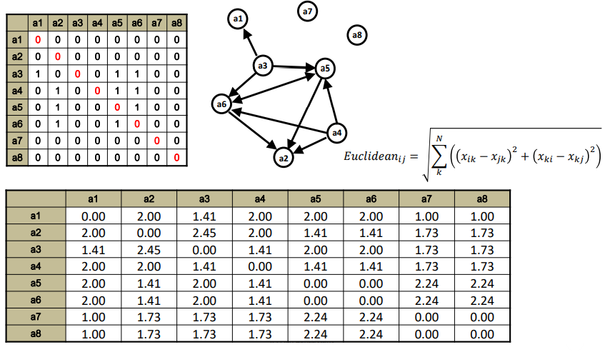

# Subgroups and Structural Equivalence

## Subgroups

Embedded within a network there are often groups of actors who interact with each other to such an extent that they could be considered to be a separate entity. This group can be called "cohesive subgroup" or community. They may allow to discover patterns in people or why certain behaviour/information is spread around a group of nodes. Also, if there are shared norms and similar actions for group members, we may be able to replace cohesive group members by a single ‘super-node’. This would reduce the complexity and size of the network and consequently aid visualization and analysis.

Let's start with the following example:

```{r echo=FALSE}
# Network creation
library(sna)
library(igraph)
network<-matrix(c(
  0,1,1,0,0,1,1,0,0,0,0,0,0,0,0,0,0,0,0,
  1,0,1,0,0,1,0,0,0,0,0,0,0,0,0,0,0,0,0,
  1,1,0,1,1,1,0,0,0,0,0,0,0,0,0,0,0,0,0,
  0,0,1,0,1,0,0,0,0,0,0,0,0,0,0,0,0,0,0,
  0,0,1,1,0,0,0,0,0,0,0,0,0,0,0,0,0,0,0,
  1,1,1,0,0,0,1,0,0,0,0,0,0,0,0,0,0,0,0,
  1,0,0,0,0,1,0,0,0,0,0,0,0,0,0,0,0,0,0,
  0,0,0,0,0,0,0,0,0,0,0,0,0,0,0,0,0,0,0,
  0,0,0,0,0,0,0,0,0,0,1,0,0,0,0,0,0,0,0,
  0,0,0,0,0,0,0,0,0,0,1,0,0,0,0,0,0,0,0,
  0,0,0,0,0,0,0,0,1,1,0,1,0,0,0,0,0,0,0,
  0,0,0,0,0,0,0,0,0,0,1,0,0,0,0,0,0,0,0,
  0,0,0,0,0,0,0,0,0,0,0,0,0,0,0,0,0,0,0,
  0,0,0,0,0,0,0,0,0,0,0,0,0,0,1,0,0,1,1,
  0,0,0,0,0,0,0,0,0,0,0,0,0,1,0,1,0,0,0,
  0,0,0,0,0,0,0,0,0,0,0,0,0,0,1,0,1,0,0,
  0,0,0,0,0,0,0,0,0,0,0,0,0,0,0,1,0,1,0,
  0,0,0,0,0,0,0,0,0,0,0,0,0,1,0,0,1,0,1,
  0,0,0,0,0,0,0,0,0,0,0,0,0,1,0,0,0,1,0),19,19)

network_i = graph_from_adjacency_matrix(network, mode = "undirected")
network = as.network(network, directed=F)
plot(network_i,
     vertex.label.dist=3,
     vertex.label.cex = 0.7,
     edge.arrow.size = 0.5,
     vertex.color = "cornflowerblue",
     displaylabels=T,
     vertex.size = 10,
     vertex.label.family = "Helvetica",
     arrow.mode = 0)
```

### Components

*Who would be able to “eventually” share information with each other?* 

A subset where everyone is directly or indirectly connected to everyone else is said **component**. 

<aside>
💡 *Note that if actors $a$ and $b$ are at least indirectly connected, and actor $c$ is at least indirectly connected to $b$, then actor $c$ is at least indirectly connected to a. Hence all actors belong to one and only one component.*

</aside>


### Cliques

```{r, fig.cap="cliques"}
plot(network_i,
     vertex.label.dist=3,
     vertex.label.cex = 0.7,
     edge.arrow.size = 0.5,
     vertex.color = "cornflowerblue",
     displaylabels=T,
     vertex.size = 10,
     vertex.label.family = "Helvetica",
     mark.groups = list(c(14,18,19),c(1,2,3,6),c(1,7,6),c(3,4,5)),
     mark.col = NA,
     mark.border=c("red","blue", "orange","green"),
     margin = c(0,0,0,0),
     arrow.mode = 0)
```

A subset where everyone is directly connected to everyone else in the subset is called a **clique**.

<aside>
💡 *Note that both an actor and a dyad might belong to more than one clique. In order to limit the overlapping of cliques, it is possible to increase the minimum size of a clique.*

</aside>

### K-cliques

A subset where everyone is connected to everyone else in the subset by at most $K$ steps is called $K$-cliques. 

By considering the previous network, the $2$-cliques are: 

- $14, 15, 17, 18, 19$;
- $14, 15, 16, 17, 18$;
- $9, 10, 11, 12$;
- $1, 2, 3, 6, 7$;
- $1, 2, 3, 6, 4, 5$;

```{r, fig.cap = "2 cliques"}
plot(network_i,
     vertex.label.dist=3,
     vertex.label.cex = 0.7,
     edge.arrow.size = 0.5,
     vertex.color = "cornflowerblue",
     displaylabels=T,
     vertex.size = 10,
     vertex.label.family = "Helvetica",
     mark.groups = list(c(14, 15, 17, 18, 19),c(14, 15, 16, 17, 18),
                        c(9, 10, 11, 12), c(1, 2, 3, 6, 7), c(1, 2, 3, 6, 4, 5)),
     mark.col = NA,
     mark.border=c("red","orange","green","blue","violet"),
     margin = c(0,0,0,0),
     arrow.mode = 0)
```

<aside>
💡 Note that actors might become cliques through others that are not members themselves. For instance, if we consider the 2-clique composed by $K_2 = \{14,15,17,18,19\}$ thanks to 16.

</aside>

By considering instead 3-cliques, we obtain: 

- $14, 15, 16, 17, 18, 19$;
- $1, 2, 3, 4, 5, 6, 7$;
- $9, 10, 11, 12$.

If $K = N-1$, then we get a component, while if $K=1$, we get a normal clique. 

```{r}
# Compute the cliques
# Returns number of cliques per each node
clique.census(network, mode = "graph")
```

### K-clans

A $K$-clique where everyone is connected to everyone else in the subset by at most K steps through its own members is called $K$-clan. This means that actors become cliques only through cliques members. 

Some 2-clans in the network are:

- 14, 15, 18, 19;
- 14, 17, 18, 19;
- 9, 10, 11, 12;
- 1, 2, 3, 6, 7;
- 1, 2, 3, 6, 4, 5.

```{r, echo=FALSE, fig.align='center', fig.pos='h!', out.width='80%', fig.cap="Example of 4-clan"}
plot(network_i,
     vertex.label.dist=3,
     vertex.label.cex = 0.7,
     edge.arrow.size = 0.5,
     vertex.color = "cornflowerblue",
     displaylabels=T,
     vertex.size = 10,
     vertex.label.family = "Helvetica",
     mark.groups = list(c(14, 17, 18, 19), c(14, 15, 18, 19)),
     mark.col = NA,
     mark.border=c("red","blue"),
     margin = c(0,0,0,0),
     arrow.mode = 0)
```

## Equivalence

### Core periphery

If we try to represent the network with an adjacency matrix, we would notice that cliques are evident by $1$s zones. In order to get a completely filled by $1$s zone, there should be a direct path between all nodes. Based on the size of these blocks, we can distinguish the core from the periphery. In fact, the periphery will have zeros zones, if not connected to anyone, or $1$ and $0$s zones, while the core will have $1$s zones. 

```{r, echo=FALSE, fig.align='center', fig.pos='h!', out.width='60%', fig.cap=""}

```

### Structural equivalence

In social network analysis, two nodes are considered **structurally equivalent** if they have the same neighborhoods – they are connected to the same others. Structural equivalence is related to the roles we play in the network and to the fact that people that play the same role in the network act similarly. 

Structural equivalence examines the direct connections of an actor to other actors in the network. Two actors are structurally equivalent if they send ties to the same third parties, and receive ties from the same third parties. They do not need to have a direct tie to each other to be equivalent.

It is a useful concept to identify similarities in attitudes and behaviours of nodes in the network and they tend to show homogeneity, as actors in the same cohesive subgroup. This similarity may be due to environment influence, due to their role or their shared neighbours. Remember that persons adapt to their social environments, and therefore actors with similar social environments will tend to have certain similarities.

<aside>
💡 *For instance, in the network below, we know that there are some nodes that have the same behaviours: $\{f, g\}, \{c, d\}, \{i, j\}$.*

</aside>

```{r, echo=FALSE, fig.align='center', fig.pos='h!', out.width='50%', fig.cap=""}

```

### Regular equivalence

Regular equivalence is a restriction of structural equivalence according to which actors need to be connected to the same actors to be equivalent. Therefore, two actors are **regular equivalent** if they are equally related to equivalent others. Two nodes are said to play the same role (i.e., are regularly equivalent) if they have ties to the same roles. 

<aside>
💡 *For instance, we can distinguish two types of nodes: $\{b,c,d,e\}, \{f,g,h,i,j\}$.*

</aside>

### Blockmodeling

**Blockmodel** (sometimes also **block model**) in blockmodeling (part of network science) is defined as a multitude of structures, which are obtained with:

- **identification of all vertices** (e.g., units, nodes) within a cluster and at the same time representing each cluster as a vertex, from which vertices for another graph can be constructed;
- **combination of all the links** (ties), represented in a block as a single link between positions, while at the same time constructing one tie for each block. In a case, when there are no ties in a block, there will be no ties between the two positions, that define the block.

The aim of blockmodeling is to produce a simplified or reduced matrix. We first arrange the rows and columns of the adjacency matrix so that structurally equivalent actors are grouped together. This grouping induces blocks within the matrix. For pure structural equivalence, the blocks are either all ones or all zeros and are called $1$-blocks and $0-blocks$, respectively.

Some types of blocks can be:

- complete: filled with 1s;
- null: filled with 0s;
- regular: one covered rows and columns;
- row-dominant or col-dominant, whenever we can distinguish a block of nodes and links as a cluster (there exists at least one row/column with all 1s);
- row-functional or col-functional: all starting nodes link to some other nodes and vice-versa, if there is just one 1 in each row/column;
- row-regular or col-regular: each row/column is covered;

```{r, echo=FALSE, fig.align='center', fig.pos='h!', out.width='50%', fig.cap="Nine types of connection between clusters"}

```


## Structural Equivalence on R

We can treat matrices as proximity measure and apply classification and clustering techniques. 
```{r include=FALSE}
# equivalence
network_2<-matrix(c(
  0,0,0,0,0,0,0,0,
  0,0,0,0,0,0,0,0,
  1,0,0,0,1,1,0,0,
  0,1,0,0,1,1,0,0,
  0,1,0,0,0,1,0,0,
  0,1,0,0,1,0,0,0,
  0,0,0,0,0,0,0,0,
  0,0,0,0,0,0,0,0),8,8,byrow=T)
```

### Hamming Structural Equivalence

$$
\text { Hamming }_{i j}=\sum_{k}^{N}\left(\left|x_{i k}-x_{j k}\right|+\left|x_{k i}-x_{k j}\right|\right)
$$

Suppose there are two nodes $i,j$ and we want to compute the Hamming distance between the link of these two nodes with $k$:

- if both $i,j$ are linked to $k$, then $|1-1| = 0$;
- if both $i,j$ are not linked to $k$, then $|0-0| = 0$;
- if only one of them is linked to $k$, then $|1-0| = 1$.

<aside>
💡 *Note that this example covers only the situations with direct links from $i,j$ to $k$, but also the vice-versa must be considered.*

</aside>

```{r, echo=FALSE, fig.align='center', fig.pos='h!', out.width='70%', fig.cap=""}

```

```{r}
# Constructing the distance matrix with the Hamming distance
network_2_SEH<-sedist(network_2, method="hamming")
network_2_SEH 
```

```{r, echo=FALSE, fig.align='center', fig.pos='h!', out.width='80%', fig.cap="Same distance matrix obtained in the chunk"}

```

```{r, out.width="80%"}
# Clustering
network_2_SEHD<-as.dist(network_2_SEH)

# Clustering on the Humming distance
network_2_SEHD_HC<-hclust(network_2_SEHD,method="complete")
plot(network_2_SEHD_HC)
```

### Euclidean Structural Equivalence

In this case, a pair of structurally equivalent actors would yield a distance of zero. Values close to zero would indicate that the actors involved are nearly structurally equivalent.

$$
Euclidean_{ij} = \sqrt{\sum_k^N \Big((x_{ik}-x{jk})^2+(x_{ki}-x_{kj})^2\Big)}
$$

```{r , out.width="80%"}
network_2_SEE<-sedist(network_2, method="euclidean")
network_2_SEE

network_2_SEED<-as.dist(network_2_SEE)
network_2_SEED_HC<-hclust(network_2_SEED,method="complete")
plot(network_2_SEED_HC)
```

Suppose having two nodes $i,j$ pointing to $k$. We aim to compute the euclidean distance between $x_{ik}$ and $x_{jk}$. 

```{r, echo=FALSE, fig.align='center', fig.pos='h!', out.width='70%', fig.cap=""}

```


```{r, echo=FALSE, fig.align='center', fig.pos='h!', out.width='70%', fig.cap="Example of distance matrix computed with Euclidean distance, as shown in the chunk above"}

```
