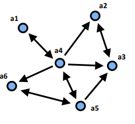
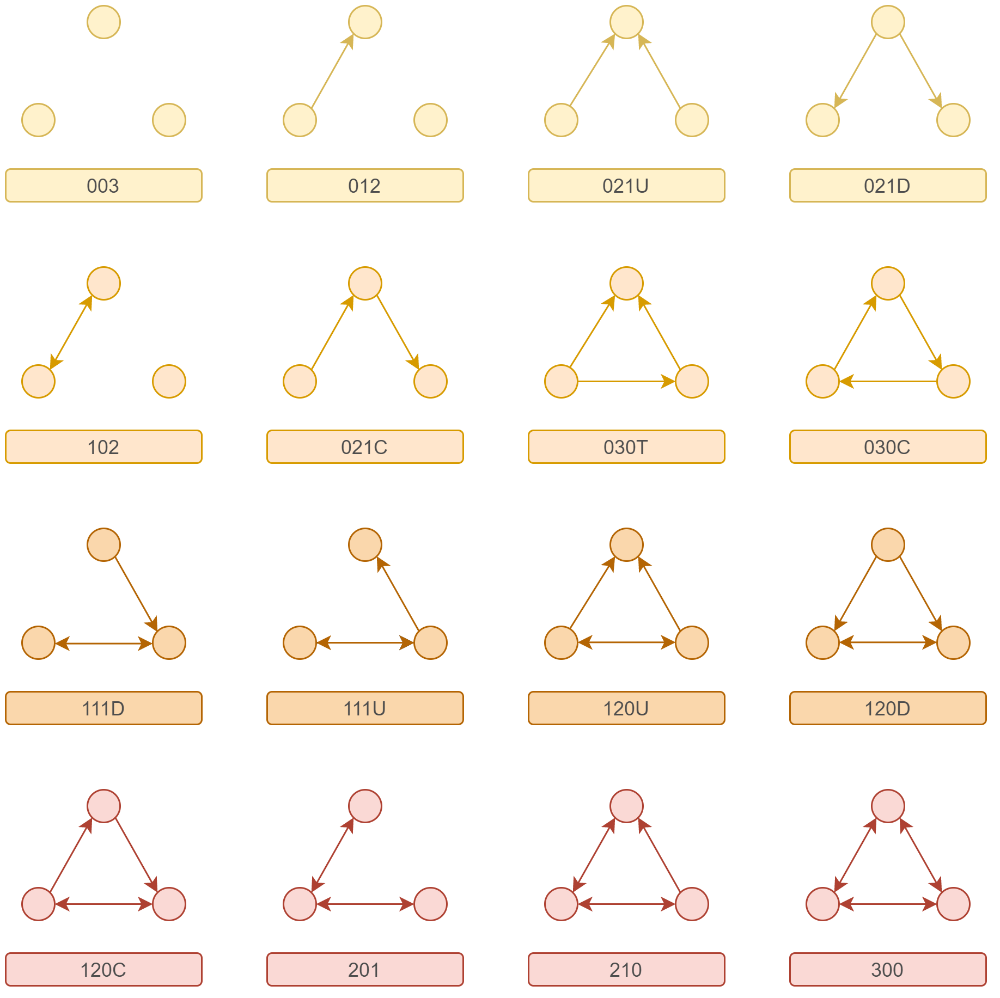

# Reciprocity and transitivity

## Dyads

### Dyad census

With **dyad census**, we count how many mutual, asymmetric and null dyads there are in the network. By looking at this network, there are:

-   mutual dyads: $4$;
-   asymmetric dyads: $4$;
-   null dyads: $(6\cdot 5)/2 - 8 = 7$ (removing all links, counting mutual dyads one time).

```{r, echo=FALSE, fig.align='center', fig.pos='h!', out.width='50%', fig.cap="Example of directed network"}

```

<aside>

💡 *Get the total dyads available as* $n(n-1)/2$ and then remove the total amount of dyads actually existing (sum mutual and asymmetric's).

</aside>

*Given the density, what would be the expected dyad census?*

-   Mutual dyads: $d*d$;
-   Asymmetric dyads: $2d*(1-d)$;
-   Null dyads: $(1-d)(1-d)$;

In total, if all dyads existed in the network, the density would be:

$$
\begin{aligned}
d \cdot d+2d\cdot (1-d)+(1-d)(1-d)&= d\cdot(d+1-d)+(1-d)\cdot(d+1-d) \\
&= d+1-d = 1
\end{aligned}
$$

### Reciprocity

*Is there more reciprocity in the network than by chance?*

There are two indexes for computing reciprocity:

-   Compute the number of mutual dyads in the network and compare it for the total amount of possible mutual dyads ($2 \cdot mutual + asymmetric$):

    $$
      \frac{2\cdot M}{2\cdot M+A}
      $$

    <aside>

    💡 *In the previous example, we would get* $2\cdot4/(2\cdot4+4) = 8/12 = 0.667$.

    </aside>

    <aside>

    💡 *Suppose that the previous network doesn't have reciprocal edges, then reciprocity would be* $0/(0+8) = 0$, because the index of reciprocity would be $2\cdot 0/(2\cdot 0+A) = 0$. If instead all edges are mutual, then the highest reachable value is 1, because $2\cdot M/(2\cdot M+A) = 2M/(2M) = 1$.

    </aside>

    *Note that UCINET adds the number of symmetric pairs as well as the reciprocates ties, including the case where there is a reciprocated zero in the adjacency matrix*.\

-   Considering the density, we would obtain the reciprocity index by:

    $$
      \frac{2\cdot M}{2\cdot M+A} = \frac{2d\cdot d}{2 d\cdot d+2d\cdot(1-d)} = \frac{d}{d+(1-d)} = d
      $$

### On R

```{r}
mat6<-matrix(c(0,0,0,1,0,0,
               0,0,1,0,0,0,
               0,1,0,0,0,0,
               1,1,1,0,1,1,
               0,0,1,1,0,1,
               0,0,0,0,1,0),6,6, byrow=T)

# Dyad Census
sna::dyad.census(mat6, g=NULL)

# Reciprocity index
# Like edgewise but multiplied for m/(m+a)
sna::grecip(mat6,measure="dyadic")

# Reciprocity index
# Edgewise, 2m/(2m+a)
sna::grecip(mat6,measure="edgewise")

# Density
sna::gden(mat6)
```

## Triads

### Triad Census

According to the Davis and Leinhardt triad census, there are 16 ways to arrange a triad in directed networks. The `sna` library on R helps to count how many of them there are in a network. The triads are labelled using the MAN convention:

-   Mutuals, dyads with reciprocated ties;
-   Asymmetrics, dyads with unreciprocated ties;
-   Nulls, dyads with no tie.

*For instance,*

-   *003: 3 non-null, 0 mutual and asymmetric;*
-   *111D: 1 mutual, 1 asymmetric, 1 non-dyad*
-   *021D: 0 mutual, 2 asymmetric, 1 null dyads.*

In addition, letters indicate:

-   D: down arrows;

-   U: up arrows;

-   C: cycle;

-   T: transitivity.

```{r}
mat6<-matrix(c(0,0,0,1,0,0,
               0,0,1,0,0,0,
               0,1,0,0,0,0,
               1,1,1,0,1,1,
               0,0,1,1,0,1,
               0,0,0,0,1,0),6,6, byrow=T)

# Triad census
sna::triad.census(mat6)
```

```{r, echo=FALSE, fig.align='center', fig.pos='h!', out.width='80%', fig.cap="MAN Nomenclature"}

```

By considering the code output and the triad census legend, we could focus for instance on 111U triad and try to detect them:

-   $a_1, a_4, a_6$
-   $a_1, a_4, a_2$
-   $a_1, a_4, a_3$
-   $a_2, a_4, a_5$
-   $a_3, a_5, a_6$

### Transitivity

In order to know whether a network is transitive, we can compare the transitivity computed through `gtrans()` with the density of the network. Transitivity is computed as the ratio between a dyad and the number of dyads between these two nodes plus the number of tryads there are:

$$
Transitivity = \frac{\sum_{i,j,k}x_{ij}x_{jk}x_{ki}}{\sum_{i,j,k}x_{ij}x_{jk}}
$$ 

To simplify, we count the proportion of triads in which $A \rightarrow B \rightarrow C \implies A\rightarrow C$ over the total triads that go from $A$ to $B$ and from $B$ to $C$.

```{r}
# Transitivty
sna::gtrans(mat6)
# Density
sna::gden(mat6)
# Also density
sum(mat6)/(nrow(mat6)*(nrow(mat6)-1))
```

Watts and Strogatz proposed a measure for undirected networks called **clustering coefficient** to capture the extent to which a network had areas of high and low density:

-   measure the density of ties in each node's ego network;
-   average the qauntity across all nodes to get the overall clustering coefficient.

If the clustering coefficient is weighted by the number of pairs of nodes in every ego's network it equals the transitivity coefficient. Watts and Strogatz use this coefficient to define small-world networks.
