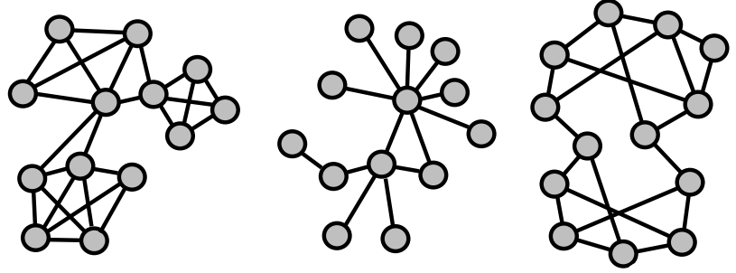
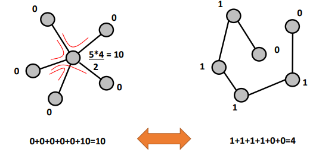
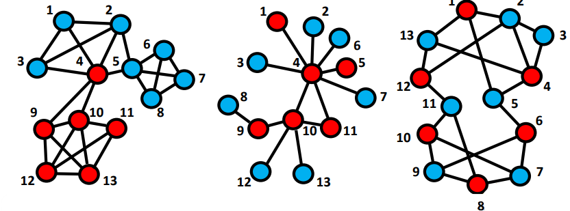

# ERGMs

## Introduction

Suppose we collect data about $7$ females and $6$ males. Why should we end up observing a specific network instead of another?

The probability of observing the network $x$ equals:

$$
P(X=x) = \frac{exp(\theta'z(x))}{\kappa(\theta)}
$$

Consider the network as the aggregated result of **tie-based decisions** among pairs of nodes. Everyone behaviours according to the same set of rules, constructing a network with a specific structure (i.e. **homophily effect**). 

These tie-based decisions are driven by a **combination of social forces** which are not directly observable, therefore the observed network is useful to get an idea of how they’re made. We only observe the aggregated outcome of the combination of hidden forces. The aggregation of these dyadic outcomes will contain some randomness. 

$$
\begin{aligned}
\operatorname{Pr}\left(X_{i j}=1 \mid \mathbf{X}_{i j}^{c}\right) &=\frac{\operatorname{Pr}\left(\mathbf{X}=\mathbf{x}_{i j}^{+}\right)}{\operatorname{Pr}\left(\mathbf{X}=\mathbf{x}_{i j}^{+}\right)+\operatorname{Pr}\left(\mathbf{X}=\mathbf{x}_{i j}^{-}\right)} \\&=\frac{\exp \left\{\boldsymbol{\theta}^{\prime} \mathbf{z}\left(\mathbf{x}_{i j}^{+}\right)\right\}}{\exp \left\{\boldsymbol{\theta}^{\prime} \mathbf{z}\left(\mathbf{x}_{i j}^{+}\right)\right\}+\exp \left\{\boldsymbol{\theta}^{\prime} \mathbf{z}\left(\mathbf{x}_{i j}^{-}\right)\right\}}
\end{aligned}
$$
As Borgatti et al. states in Analyzing Social Networks, these models are related to more general linear models of standard statistics but deal with the fact that we cannot assume independence of observations. Conditional dependence is related to the fact that if two edges share a common vertex, then they are dependent, conditional on the rest of the graph. These models are called Markov random graphs models.  

### Density - Is there an overall tendency to build or refrain from building ties?

We could refer to this question with the density. Consider that connections may require time and energy, but also provide positive benefits. 

<aside>
💡 *By looking at the following networks, we can see three different networks. The number of ties is respectively $25, 13$ and $20$. The density is computed as the number of ties over the total number of ties there could be (i.e. $78$). Therefore, the density equals $0.32, 0.167, 0.256$.*

</aside>

```{r, echo=FALSE, fig.align='center', fig.pos='h!', out.width='50%', fig.cap=""}

```

If we observe a low number of ties in our network (given network size), then the underlying force was probably one that tended not to build ties, rather than build ties. However, there also might be a high tendency to build ties in a network and nevertheless we might still end up with a low number of realized ties. 

### Centralization - Is there a tendency for popular people to obtain more ties?

If so, popular nodes might be more attractive, otherwise, there are limits to the level of variation in degree. According to the **Matthew effect**, the rich get richer and the poor get poorer, also called preferential attachment. 

In order to answer this question, we should focus on the number of 2-stars as a measure of centralization. Consider two networks that have roughly the same density and the same number of nodes. 

<aside>
💡 *For instance, by considering the two networks below, despite both networks having similar density, the 2-stars is very different.*

</aside>

```{r, echo=FALSE, fig.align='center', fig.pos='h!', out.width='50%', fig.cap=""}

```

If we observe a high number of two-stars in our network given the number of ties, then the underlying force was probably one that tended to prefer to build ties to nodes with a high degree.

<aside>
💡 *In the previous 3 networks, the 2-stars measure is $77, 40$ and $43$.*

</aside>

### Clustering - Is there a tendency for triadic closure?

If not, open structures provide access to unique alters; au contraire, triadic closure is easy and provides a feeling of safety. By looking at the number of closed triads, we could answer this question. 

<aside>
💡 *In the previous 3 networks, the number of closed triads is $17, 1$ and $1$.*

</aside>

If we observe a large number of closed triads in our network, given the number of ties and 2-stars, then the underlying force was probably one that tended to prefer to build ties between nodes that have common connections.

## How to get values for these forces

In order to figure out the values above, count specific properties in the observed network to provide information about local social forces that determines the structure of the network. 

### Introduction

Logit models are expressed in the following form: 

$$
Pr(X=x) = \frac{exp(\theta'z(x))}{\kappa(\theta)}
$$

- $\theta$ is a vector of model parameters;
- $z(x)$ is a vector of network statistics.

They come from the exponential form, in which the probability function depends on an exponential function of a linear combination of network statistics. 

<aside>
💡 *Suppose we want to know whether a tie emerges because of an indirect connection based on two other ties. We cannot simply perform a logit regression because this reasoning could be applied to all the ties in the triad. That’s why MCMC (Markov Chain Monte Carlo) are necessary.*

</aside>

## Notal attributes

```{r, echo=FALSE, fig.align='center', fig.pos='h!', out.width='50%', fig.cap=""}

```

Suppose we detain a network whose nodes have attributes (e.g. gender-based):

- *Is there a tendency for red to be connected to red and blue to blue?*
    
    We could compute it by looking at the number of **homophilous** ties. It's the tendency to be connected to nodes similar to us. If there's high homophily, the same types are easier to connect to, otherwise, different types hold complementary resources. By looking at the three networks, we know that homophilous ties are:
    
    - $\# H = 21$ homophily
    - $\# H = 6$ neutrality
    - $\# H = 1$ heterophily
- *Is there a tendency for males (red nodes) to have more ties than females (blue nodes)?*
    
    Being of different types may change the behaviour of nodes? In the three examples, we know that:
    
    - red is slightly more connected;
    - red nodes are more connected;
    - all nodes are almost equally connected.
    
    The difference can be detected through the **difference in average degree**s **for red and blue:**
    
    - reds: $26/5$, blues: $24/6$;
    - reds: $19/5$, blues: $7/6$;
    - reds: $19/5$, blues: $21/6$.

### Example with MPNet

Through MPNet it’s possible to run ERGMs to test the multiple effects at the same time. It provides edges, 2-star, triangles (closed triads), gender activity (i.e. the distinction between males and females) and gender interaction (whether the gender difference can be also found on the number of ties):

- the first network has particular significance for the 2-stars, triangles and gender interaction;
- the second network has particular significance just for stars and triangles;
- the third one is just for the 2-stars.

## Pseudolikelihood

Rather than consider the probability of observing the graph, the pseudo-likelihood:

$$
P\left(X=X_{\text {obs }}\right) = \frac{e^{\theta_{L}\ \# L_{\text {obs}}+\theta_{S} \ \# S_{\text {obs}}+\theta_{T}\ \# T_{\text {obs}}}}{\sum_{k=1}^{\text {All }}[e^{\theta_{L} \#L_{k}+\theta_{S} \ \# S_{k}+\theta_{T} \ \#T_{k}}]}
$$

Consider the presence or absence of a tie between actors $i$ and $j$ as a function of the rest of the graph. Given the rest of the graph, what is the likelihood of $x_{ij}$ being present?

$$
\begin{aligned}
P(x_{ij} =1 \mid X_{ij}^{C}) &=\frac{P\left(X=X_{obs}^{i}=1\right)}{{P}\left({X}={X}_{{obs}}^{{i}=0}\right)+{P}\left({X}={X}_{{obs}}^{{i}=1}\right)}\\
&= \frac{\frac{e^{\theta_{L}\ \# L_{\text {obs}}^{ij=1}+\theta_{S} \ \# S_{\text {obs}}^{ij=1}+\theta_{T}\ \# T_{\text {obs}}^{ij=1}}}{\sum_{k=1}^{\text {All }}[e^{\theta_{L} \#L_{k}+\theta_{S} \ \# S_{k}+\theta_{T} \ \#T_{k}}]}}{\frac{e^{\theta_{L}\ \# L_{\text {obs}}^{ij=0}+\theta_{S} \ \# S_{\text {obs}}^{ij=0}+\theta_{T}\ \# T_{\text {obs}}^{ij=0}}}{\sum_{k=1}^{\text {All }}[e^{\theta_{L} \#L_{k}+\theta_{S} \ \# S_{k}+\theta_{T} \ \#T_{k}}]}+\frac{e^{\theta_{L}\ \# L_{\text {obs}}^{ij=1}+\theta_{S} \ \# S_{\text {obs}}^{ij=1}+\theta_{T}\ \# T_{\text {obs}}^{ij=1}}}{\sum_{k=1}^{\text {All }}[e^{\theta_{L} \#L_{k}+\theta_{S} \ \# S_{k}+\theta_{T} \ \#T_{k}}]}}
\end{aligned}
$$

$$
P(X_{ij}=1|X_{ij}^c) = 
\frac{e^{\theta_{L}\ \# L_{\text {obs}}^{ij=1}+\theta_{S} \ \# S_{\text {obs}}^{ij=1}+\theta_{T}\ \# T_{\text {obs}}^{ij=1}}}
{e^{\theta_{L}\ \# L_{\text {obs}}^{ij=0}+\theta_{S} \ \# S_{\text {obs}}^{ij=0}+\theta_{T}\ \# T_{\text {obs}}^{ij=0}}+
e^{\theta_{L}\ \# L_{\text {obs}}^{ij=1}+\theta_{S} \ \# S_{\text {obs}}^{ij=1}+\theta_{T}\ \# T_{\text {obs}}^{ij=1}}}
$$

The same formula can be defined for $X_{ij} = 0$. 

$$
\begin{aligned}
\frac{{P}\left({X}_{i,j}=1 \mid {X}_{i,j}^{{c}}\right)}{{P}\left({X}_{i,j}=0 \mid {X}_{i,j}^{{c}}\right)} &= \frac{{e}^{\theta_{{L}}} \ \# {~L}_{{obs}}^{{ij}=1}+\theta_{{S}} \ \# {~S}_{{obs}}^{{ij}=1}+\theta_{T} \ \# {~T}_{{obs}}^{{ij}=1}}{e^{\theta_{{L}}} \ \# {~L}_{\text {obs }}^{{ij}=0}+\theta_{{S}} \ \# {~S}_{\text {obs}}^{{ij}=0}+\theta_{T} \ \# {~T}_{\text {obs}}^{{ij}=0}} \\
&= e^{\left[\theta_{L} \ \# L_{\text {obs }}^{i j=1}+\theta_{S} \ \# S_{\text {obs }}^{i j=1}+\theta_{T} \ \# T_{\text {obs }}^{i j=1}\right]-\left[\theta_{L}\ \# L_{\text {obs}}^{i j=0}+\theta_{S} \ \# S_{\text {obs}}^{i j=0}+\theta_{T} \ \# T_{\text {obs }}^{i j=0}\right]} \\
&= e^{\theta_L\left[\#L_{obs}^{ij=1}- \#L_{obs}^{ij=0}\right]+
\theta_S\left[\#S_{obs}^{ij=1}- \#S_{obs}^{ij=0}\right]+
\theta_T\left[\#T_{obs}^{ij=1}- \#T_{obs}^{ij=0}\right]}
\end{aligned}
$$

By considering the logarithm, we get a simple logistic regression equation. Does the local surrounding predict the presence or absence of a tie between $i$ and $j$?

- $\theta_L$: what is the overall chance of a tie? Through density
- $\theta_S$: if actors $i$ and $j$ have more connections, does this increase the chance of a tie between $i$ and $j$? Through 2-star
- $\theta_T$: if actors $i$ and $j$ share the same others, does this increase or decrease the chance of a tie between $i$ and $j$? Triangle

### Problems

Classic regression assumes independent cases. Pseudolikelihood estimates are known to be wrong:

- Overestimation of significance;
- Often overestimation of effects and sometimes completely wrong.

The alternative is to approximate MLE through the MCMC algorithm. 

## MCMC

### Introduction

We observed a network, and assume that it is the result of a combination of forces, e.g.:

- an overall tendency to build ties (or not);
- a preference to build ties to others with high degree (or not);
- and a tendency for closure (or not).

These forces are captured by the parameters $\theta_L, \theta_S, \theta_T$:

$$
P(X=X_{\text{obs}}) = \frac{e^{\theta_{L} \# L_{\text {obs}}+\theta_{S} \# S_{\text {obs}}+\theta_{T} \# T_{\text{obs}}}}{\sum_{k=1}^{\text{All }}[e^{\theta_{L} \#L_{k}+\theta_{S} \# S_{k}+\theta_{T} \#T_{k}}]}
$$

Any values for these parameters could lead to a particular network, but some are more likely to generate it. We aim to find those that maximize the chance of observing the graph. To approximate the MLE values for these three parameters, Markov Chain Monte Carlo will be used. 

### Logic

This approach is based on the Markov Chains. We can simulate a network through random graphs:

1. Start with any network with a specific number of nodes;
2. Select a random dyad at a time;
3. Update the selected dyad using a formula, based on the current state in the surrounding only:
    
$$
P\left(X_{ij}^{t+1}=1 \mid x_{ij}^{C, t}\right)= \frac{e^{\theta_{L}\left[\# ~L_{t}^{ij=1}-\# ~L_{t}^{ij=0}\right]+\theta_{S}\left[\# ~S_{t}^{ij=1}-\# ~S_{t}^{ij=0}\right]+\theta_{T}\left[\# ~T_{t}^{ij=1}-\# {~T}_{t}^{ij=0}\right]}}{1+e^{\theta_{L}\left[\# ~L_{t}^{ij=1}-\# ~L_{t}^{ij=0}\right]+\theta_{S}\left[\# ~S_{t}^{ij=1}-\# ~s_{t}^{ij=0}\right]+\theta_{T} \left[\# T_{t}^{ij=1}-\# T_{t}^{ij=0}\right]}}
$$
    
4. If we use the same rules for a long enough time, the Markov chain forgets about history
(forgets the starting network), i.e., only takes into account the rules of the process/game ad the networks generated will tend to go towards a stable “equilibrium” (i.e. similar networks). Time after time, the algorithm will show a different characteristic of the network;

5. If we use the estimates that truly reflect the forces which are most likely to have led to our observed network, then the process will generate networks that are similar to our observed
network. That is provided we run this long enough so it forgets about the start = burn-in. Of course in reality we do not know the values for the estimates but we can search for them in this way.