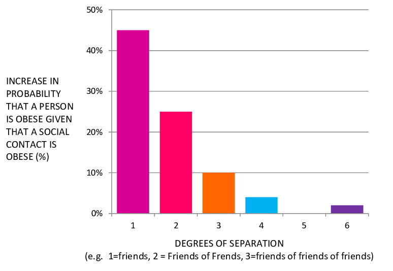
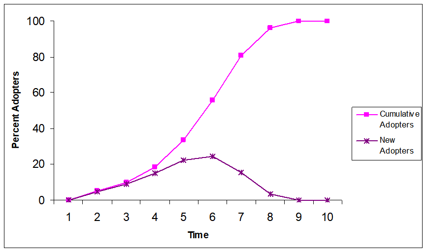
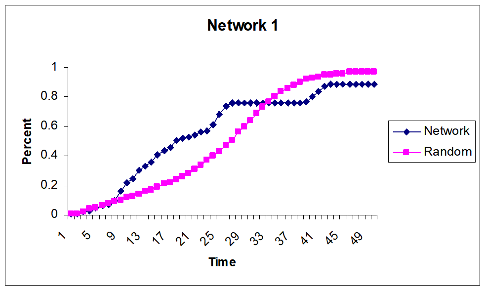
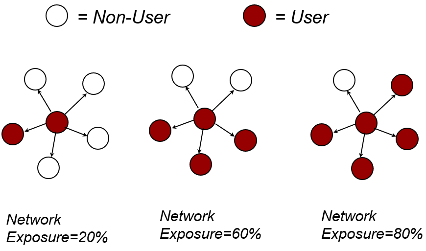
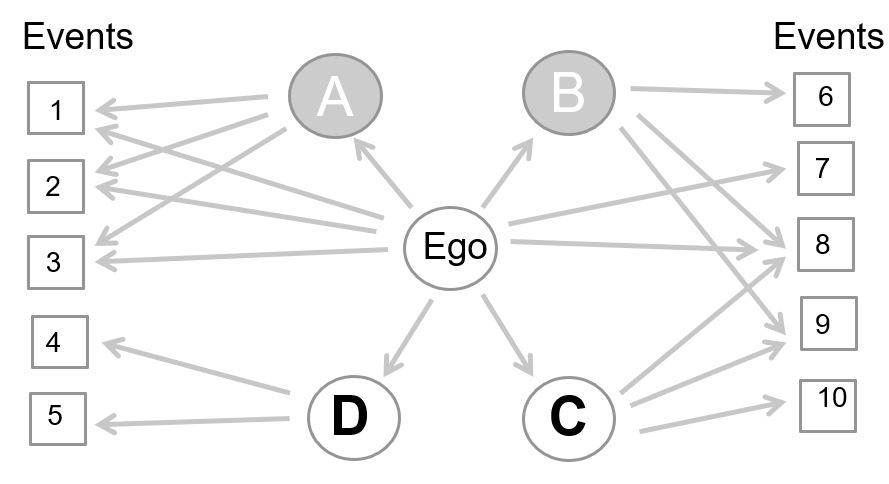
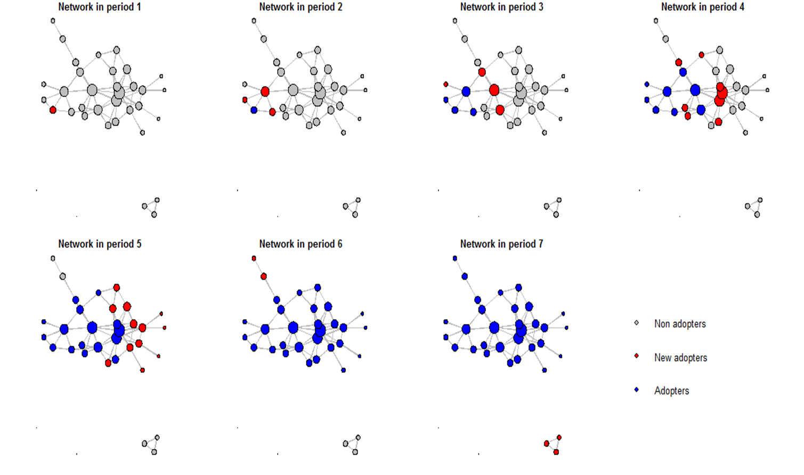
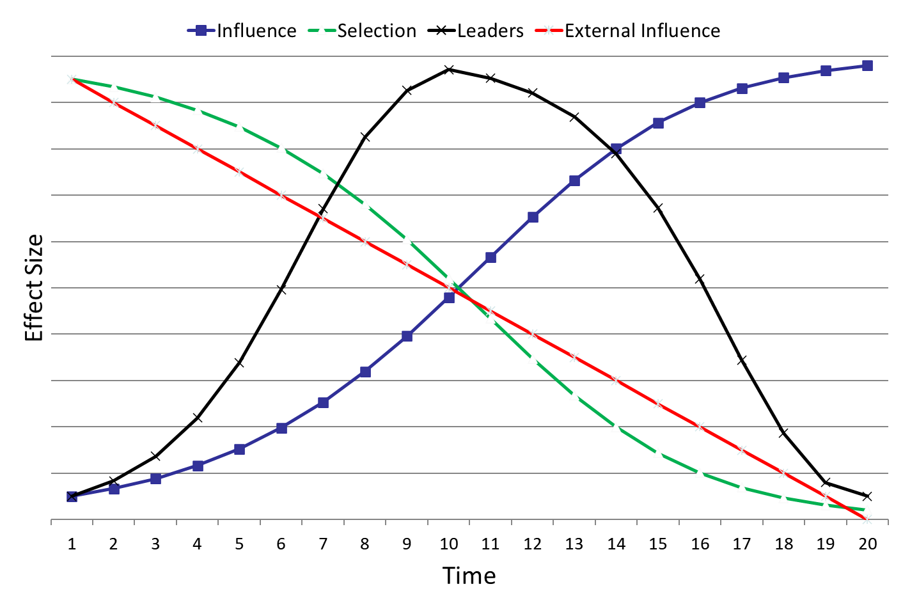

# Christakis and Valente

## Christakis

### What is clustering for Christakis?

A cluster is a group of people who are connected and are similar in characteristics.

<aside>
🌐 *For instance, Christakis detects obese and non-obese people.*

</aside>

### What are 3 potential types of reasons for finding clustering of obese and non-obese people?

- Induction effect or Social Contagion: spread from a person to a person
    
    <aside>
    🌐 *If your friends gain weight, you gain weight, and you then, in turn, impact other friends. Because we conform and we change our idea about what acceptable body size is.*
    
    </aside>
    
    <aside>
    🚬 *If your friends smoke, you might start smoking.*
    
    </aside>
    
- Homophily effect: birds of a feather flock together
    
    <aside>
    🌐 *Form a tie because we have a similar body size, to begin with, or similar interest in exercise (etc.) that might predict our body size.*
    
    </aside>
    
    <aside>
    🚬 *Friendship emerging as a result of smoking behaviour.*
    
    </aside>
    
- Confounding factor: it confounds our ability to figure out what’s going on
    
    <aside>
    🌐 *Something happening in a cluster’s environment (e.g. a gym opening, which makes all members of the cluster lose weight, or a fast-food restaurant opening, which makes all members gain weight).*
    
    </aside>
    
    <aside>
    🚬 *Environment makes both of us start/stop smoking (like an anti-smoking advertisement, or new laws that impacts one group but not another).*
    
    </aside>
    

Some examples that can be applied to these three reasons are:

- movies preferences;
- happiness;
- smiling;
- eating fast food.

### What is the meaning of 3 degrees of separation?

The plot here shows, on the Y-axis, the increase in the probability that a person is obese given that a social contact of theirs is obese and, on the X-axis, the degrees of separation between the two people. According to Christakis, there are three degrees of separation that hold for many traits, in particular, obesity:

```{r, echo=FALSE, fig.align='center', fig.pos='h!', out.width='50%', fig.cap=""}

```

- If your friends are obese you have about a 45% higher likelihood of being obese yourself;
- if your friend’s friends are obese you have about a 25% higher likelihood;
- if your friend’s friend’s friends are obese you have about a 10% higher likelihood;
- up to 3 degrees of separation is there a real relation between your body size and that person’s body size (not really any more at 4 degrees away).

### What is a multi-centric epidemic?

Obesity is a **multicentric epidemic** since there is no patient zero of this epidemic. In general, lots of people are doing things at the same time and if we focus on a certain phenomenon, we may notice that there may be a key player, but no central node that indicates the starting node. 

<aside>
🏦 *For instance, the 2008 crash was due to a single bank, therefore it was a uni-centric epidemic.*

</aside>

<aside>
💼 *For instance, the unemployment crisis is instead a multicentric epidemic, since there is no starting node for this phenomenon.*

</aside>

<aside>
🦠 *Also, the coronavirus had a patient zero that started to diffuse the pandemic. However, inside each new country, there’s a single patient zero, therefore it is a multi-centric epidemic.*

</aside>

### What might be potential mechanisms for the spread of behaviour?

Alter’s appearance or behaviour changes:

- Ego’s behaviour
    
    <aside>
    🚬 *For instance, related to smoking, seeing other people smoke makes us smoke.*
    
    </aside>
    
    <aside>
    😷 *Related to mask-wearing, we notice other people wearing masks, friends specifically, and we change our behaviour accordingly.*
    
    </aside>
    
- Ego’s expectations or perceptions of norms.
    
    <aside>
    🚬 *For instance, related to smoking, we are convinced by arguments from others about what is normal and expected. Life is short and there are so many other dangers, you should worry about smoking.*
    
    </aside>
    
    <aside>
    😷 *Related to mask-wearing, we notice contagion graphs, indications in shops and public places and people may tell us to wear the mask and that we can enter only if we wear it. That’s how our behaviour changes.*
    
    </aside>
    

## Valente

This speak is about the adoption of new ideas or practices that flows through interpersonal contacts. In particular, he speaks about:

- models of the diffusion of innovations;
- network models for diffusion (Network models of change);
- network interventions (Network models for a change).

### What is the classic idea of diffusion?

Studying how networks influence behaviour moves us from theories about networks to network theory. New ideas and practices originate enter communities from some external source (e.g. mass media, labour exchanges, cosmopolitan contact, technical shifts). Adoption of the new idea or practice then flows through **interpersonal contact networks**.

Diffusion happens out of interpersonal contact, persuasion and communication modelling. Diffusion occurs over time, usually following a trend studied in the Economy about the adoption of new products or technology, where there are nearly adopters, then diffusion and in the end the large common use/adoption of a behaviour. 

```{r, echo=FALSE, fig.align='center', fig.pos='h!', out.width='50%', fig.cap="Stages of adoption over time"}

```

Valente created mathematical models of the diffusion of innovations in different situations: for external and internal influence and when the external communications are mixed with person-to-person contact. However, it is far more interesting to study the processes that occur amongst people in the network. 

Therefore, Valente created a hypothetical community of people and the percentage of diffusion when adopters persuade non-adopters at a rate of one per cent. When this happens, we get the S-shape curve described above. But this is wrong since there’s no network in this. Once we start to see there’s clustering in the network, we notice that it all goes in a different way. In a random way, we get the S-shape, in a real network, there are some moments where the diffusion speeds up or slows down, deviating from the model. 

```{r, echo=FALSE, fig.align='center', fig.pos='h!', out.width='50%', fig.cap="S-curve to describe random behaviour adoption"}

```

### What types of network influence weights are there according to Valente?

Valente also describes the generative engine for understanding how networks influence behaviour.

1. **Direct influence**
    
    When you’re exposed to people with different behaviours, you are more likely to change your behaviour. Not only actual use but also perceived use influences behaviour. 
    
    <aside>
    🌐 *For instance, if in a network of people there are non-users and users and they interact with each other it is likely that all of them become users.*
    
    </aside>
    
```{r, echo=FALSE, fig.align='center', fig.pos='h!', out.width='50%', fig.cap=""}

```
    
2. **Indirect ties**
    
    Indirect exposures may matter in influencing others, but there’s kinda debate if there’s really an effect and how does it work. It varies by network and behaviour type. We need some quality data study to make any statement about the role of indirect influences. 
    
3. **Structural equivalent ties** 
    
    On the other hand, structural equivalence can matter according to Burt. We might be influenced by other people to who we’re not connected, but occupy the same position in the network and therefore we tend to monitor their behaviour and situation. In some cases, competition might be there (e.g. compete for the attention of a friend) or not (e.g. occupy friendship positions and be influenced one another through direct communication). 
    
4. **Tie strength**
    
    Stronger ties exert a stronger influence on ego than weaker ties. They have more influence on the ego’s behaviour than those he/she sees less frequently since they have a less emotional relationship with them. 
    
    Weak ties are important for information spread and rumours, but when it comes to behavioural change, strong ties make the difference. 
    
5. **Simmelian ties**
    
    Empirically, simmelian ties also affect people. Suppose A and B are connected together and they have a stronger influence on the ego with respect to C or F which are not connected to any other node in the ego network. Therefore, the social environment matters a lot in terms of the amount of influence that alters can exert on egos. 
    
    If all my friends are friends with each other, their behaviours are more likely to influence me than if my friends are not friends with one another, because their decisions, behaviours and communications are all reinforcing one another rather than being disparate. 
    
6. **Density weighted or Centrality Measures**
    
    We can weigh our influences by using centrality measures, which also allows us to understand who’s the ego in the network and if this fact is associated with his/her traits. The most used centrality measures are degree (in and out), closest and between centrality. There are over 100 centrality measures to use. 
    
7. **Degree weighted**
8. **Joint participation** 
    
    Whenever two or more nodes in the network participate jointly in an event, the influence on one another on its behavioural change is stronger than if they participate individually in the event. 
    
```{r, echo=FALSE, fig.align='center', fig.pos='h!', out.width='50%', fig.cap=""}

```
    
9. **Attribute weighted**
    
    In diffusion theory there’s the thought that homophily is associated with a greater social influence: if we’re similar, the flow of information and communication is easier and more frequent. 
    
    There may be some behaviours that are actually attribute specific, therefore it is more likely that the influence would occur when people are similar on the attribute.  
    
10. **Thresholds**
    
    Some people are willing to adopt a new behavior when a minority or none of their network partners are willing to (e.g. early adopters that discover all the new features and they communicate interesting facts inside the network). Other people wait until their network is filled with users before they're willing to try something (e.g. late adopters that need to adapt inside the network in order to homologate and gain benefits).
    
    People late in the diffusion process are late because of their position in the network, which gives them access to the behaviour or the information very late in the process. It still may happen to be connected to early adopters despite being late adopters. 
    
    According to Valente's Threshold model, in the x-axis there's the time in which a node adopts a behaviour, while the y-axis indicates the percentage of people that adopts a behaviour, i.e. threshold. For each time, a node adopts the behaviour. The high threshold people only get affected if people around are affected by the behaviour, while low threshold people are called early adopters and do not need to be influenced to adopt a behaviour. Also, we can distinguish between early and late adopters, while low and high threshold relies on the affection of other people. 
    

### Network Diffusion

It is possible to use a `NetdiffuseR` package to track the diffusion of information. In particular, as shown in the image below, in red there are new adopters, while in blue continuing users and in grey users that do not use or have a behaviour.  

```{r, echo=FALSE, fig.align='center', fig.pos='h!', out.width='60%', fig.cap=""}

```


**What happens over time during the diffusion process?** 

- External influence (e.g. media, advertisement, travel), whose effect decreases over time. As more people adopt, we do not worry about external influence;
- Selection, which is very high in the beginning , because in the beginning nobody does nothing in my network. Over time, as the community fills with adopters, we don’t need to make changes in the network in order to have people being consistent with the ego’s behaviour;
- Influence should increase over time: as the behaviour becomes normative, as there are more adopters, I’m more likely to change my behaviour;
- Opinion leaders, whose trend varies, when the behaviour is normative and compatible with the community. When it is not culturally compatible, opinion leaders delay their adoption.

```{r, echo=FALSE, fig.align='center', fig.pos='h!', out.width='50%', fig.cap="Phenomena that happen over time during the diffusion process and their development"}

```